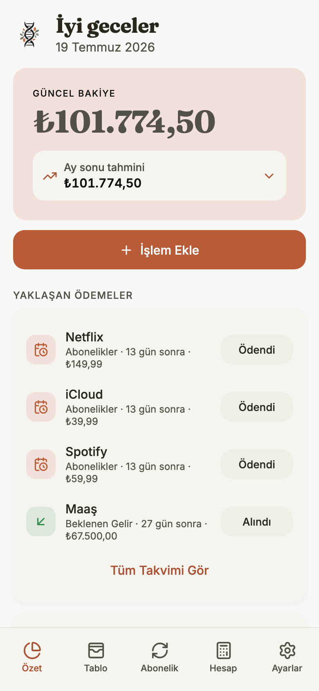
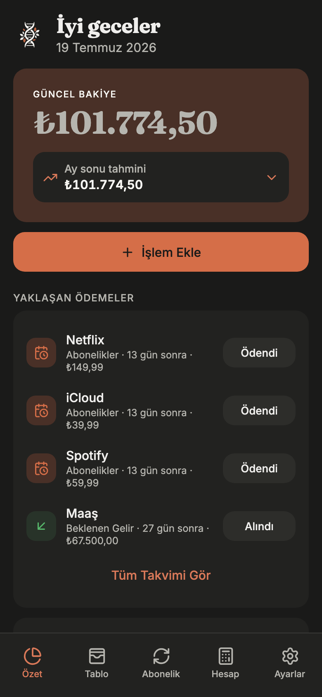
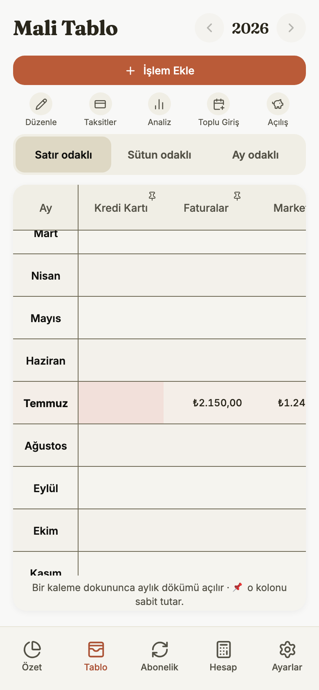
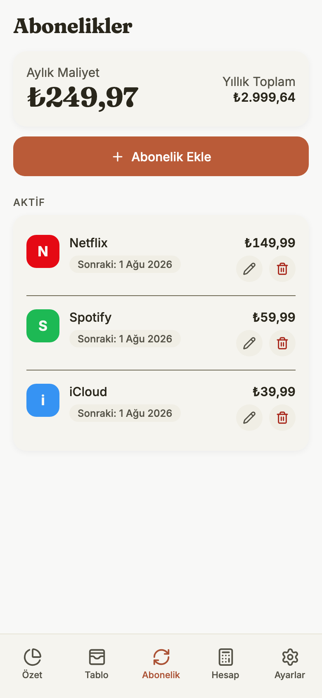
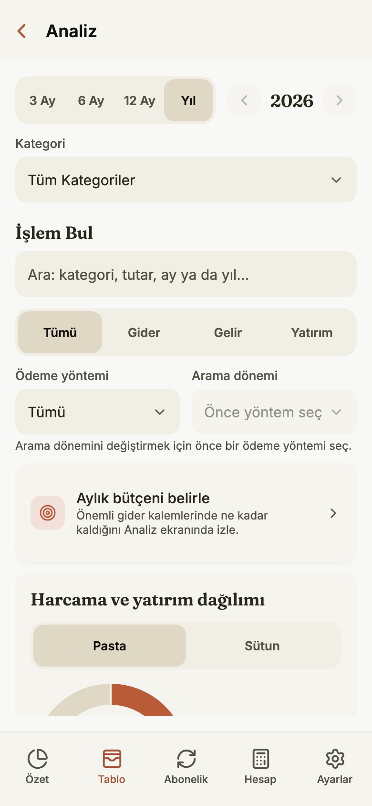

<div align="center">

<picture>
  <source media="(prefers-color-scheme: dark)" srcset="assets/brand/horizontal-dark.png">
  
</picture>

### Paran bugün nerede, yarın ne olacak — tek bakışta.

**Helix; nakit akışını, taksitlerini, aboneliklerini ve bütçelerini cihazında tutan,**
**internetsiz de çalışan kişisel finans uygulamasıdır.**

*An offline-first personal finance workspace for cash flow, installments,
subscriptions and budgets — with a spreadsheet mind and a mobile heart.*

[](https://topraksv.github.io/helix/)

[](https://github.com/topraksv/helix/actions/workflows/deploy-web.yml)
[](https://docs.expo.dev/versions/v54.0.0/)
[](tsconfig.json)
[](docs/TESTING.md)
[](#lisans--license)

</div>

<p align="center">
  
  &nbsp;&nbsp;
  
</p>

## Neden Helix?

Bir Excel tablosu para takibi için güçlüdür — ta ki formül bozulana, ileri
tarihli bir harcama bugünkü bakiyeye karışana ya da bir taksidin kaçıncı ayda
olduğunu unutana kadar. Helix, tablonun tanıdık **ay × kalem** düzenini korur;
hesaplamayı, tekrarları ve veri güvenliğini senin yerine üstlenir.

- **Ekle:** Gelir, gider, taksit veya aboneliği tek formdan kaydet. Tutarı
  "400+500" gibi bir toplam olarak bile yazabilirsin.
- **Gör:** Güncel bakiye, ay sonu tahmini, yaklaşan ödeme takvimi ve kategori
  bütçelerin tek özet ekranında birleşir.
- **Rahat ol:** Her kayıt önce cihazına yazılır; internet yokken de her şey
  çalışır. Bağlantı gelince yalnızca senin hesabına eşitlenir, silinenler tek
  dokunuşla geri alınır.

## Ekranlar

| Mali Tablo | Abonelikler | Analiz |
|:---:|:---:|:---:|
|  |  |  |
| Yıl matrisinde her ay × kalem hücresi düzenlenebilir; mevcut ay otomatik odaklanır. | Aylık/yıllık toplam maliyet, sonraki ödeme tarihi, deneme süresi ve otomatik ödeme bir arada. | Dönem bazlı grafikler, kategori bütçe durumu ve tüm geçmişte işlem arama. |

## Neler yapabilirsin?

| İhtiyacın | Gideceğin yer | Yapabileceklerin |
|---|---|---|
| **Şu anki durumum ne?** | **Özet** | Güncel bakiye, ay sonu tahmini, yaklaşan ödemeler, aylık pasta/sütun grafikler ve canlı altın–döviz fiyatları |
| **Ay ay ayrıntı** | **Mali Tablo** | Satır/sütun/ay odaklı matris, hücre detayı ve notları, toplu geçmiş girişi |
| **Tekrarlayan ödemeler** | **Abonelikler** | Aylık/yıllık maliyet, ödeme günü, deneme dönemi, otomatik ödeme |
| **Maaş ve düzenli gelirler** | **Ayarlar → Düzenli Gelirler** | Aylık, haftalık veya iki haftalık gelir kuralları; günü gelince onayla, gerçek tutarıyla işlensin |
| **Taksit ve kredi kartı** | **Mali Tablo → Taksitler** | Gerçek satın alma günü + ekstre dönemi; nakit etkisi son ödeme tarihinde |
| **Bütçe hedefleri** | **Ayarlar → Bütçeler** | Kategori başına aylık hedef, kalan tutar ve aşım uyarısı |
| **Hızlı hesap ve kur** | **Hesap** | Hesap makinesi + canlı kurla TRY/USD/EUR/GBP dönüşümü |
| **Bir işlemi bulmak** | **Mali Tablo → Analiz** | Metin, tutar, tür, kategori ve ödeme yöntemiyle arama |
| **Verini taşımak** | **Ayarlar** | JSON yedek/geri yükleme, CSV dışa aktarma, sihirbazlı Excel içe aktarma |

## Verin nerede, kim görebilir?

- **Hesapsız (local-only) mod:** Supabase yapılandırması yoksa hesap açmadan
  çalışır; bütün finansal veri cihazındaki SQLite veritabanında kalır.
- **Hesaplı mod:** Değişiklikler yalnızca senin hesabına eşitlenir. Her tablo
  owner-only RLS ile korunur; başka bir hesap satırlarını okuyamaz.
- **Bildirimler:** İzin yalnızca Ayarlar'dan istenir; kilit ekranında finansal
  ayrıntı varsayılan olarak gizlidir.
- **Dış istekler:** Piyasa/kur ve logo istekleri salt okunur, sınırlı ve
  doğrulanmış girdilerle yapılır.

Ayrıntılar için: [Gizlilik ve Veri Kullanımı](docs/PRIVACY.md).

## Tasarım

Sıcak kâğıt tonları üzerinde kil vurgusu: **Warm Organic Editorial**. Fraunces
başlıklar, Inter gövde, botanik çift sarmal logosu. Gelirler yeşil, giderler
kırmızı; light/dark tüm rol çiftleri otomatik kontrast sözleşmesinden geçer
([theme.ts](src/ui/theme.ts)). Metinler asla üç noktayla kırpılmaz, hareket
sistemi Reduced Motion tercihine uyar, grafikler ekran okuyucu için tam değerli
özet taşır.

## Çalıştırma

> **Node 22 zorunlu.** Expo SDK 54 araç zinciri Node 24+ ile uyumlu değildir.

```bash
git clone https://github.com/topraksv/helix.git
cd helix
npm ci
cp .env.example .env

npm run web                 # web development
npm run ios                 # iOS development build
```

`.env` içindeki Supabase URL ve anon key boş bırakılırsa Helix local-only
açılır. Sync için Supabase bağlamak isteyenler migration ve doğrulama
adımlarını [Release Sözleşmesi](docs/RELEASE.md)nden izleyebilir.

### Kalite kapıları

```bash
npm run typecheck           # strict TS + checked index access
npm test                    # domain, sync ve DB sınırı testleri (Vitest)
npx expo lint               # Expo/React lint
npm run test:e2e            # statik export + gerçek tarayıcı SQLite (Playwright)
```

Aynı komutlar her PR'da GitHub Actions'ta koşar; `main`'e ancak hepsi
geçtiğinde web yayımlanır. Senaryo matrisi ve cihaz kabul listesi
[Test Sözleşmesi](docs/TESTING.md)nde.

## Teknik özet

| Katman | Karar |
|---|---|
| Uygulama | Expo SDK 54, React Native 0.81, React 19, Expo Router |
| Yerel veri | `expo-sqlite` (async) + Drizzle; UI doğrudan SQL çağırmaz |
| Veri erişimi | [repo.ts](src/data/repo.ts) kararlı facade; implementasyonlar `src/data/repo/` altında |
| Sync | Atomik yazım + outbox, server-authoritative `updated_at`, LWW merge, dead-letter karantinası |
| Remote | Supabase Auth/Postgres; owner-only RLS |
| Para/tarih | Integer kuruş; `YYYY-MM-DD` tarih, `YYYY-MM` ay anahtarları |
| Test | Vitest + pgTAP + Playwright (axe ve görsel baseline'lar dahil) |

```text
src/
├── app/        Expo Router ekranları ve route grupları
├── domain/     saf para, tarih, bakiye, recurrence ve analiz kuralları
├── db/         Drizzle şeması, async SQLite client, local migration'lar
├── data/       live query'ler + kararlı repository facade
├── sync/       outbox, push/pull, session epoch, dead-letter
├── services/   import/export, FX, piyasa, bildirim sınırları
├── auth/       Supabase oturumu, recovery, cihaz kilidi
├── i18n/       kullanıcıya görünen bütün Türkçe metinler
└── ui/         ortak component'ler, tablo, grafik, motion, tema
```

Kalıcı mimari kurallar [AGENTS.md](AGENTS.md)'de, yayın prosedürü
[docs/RELEASE.md](docs/RELEASE.md)'de.

## Platform notları

- Web her `main` push'unda GitHub Pages'e otomatik yayımlanır; iOS/Android
  güncellemeleri ayrı bir EAS Update (OTA) adımıdır.
- iOS yerel cihaz build'i doğrulanmış kurulu uygulama yoludur; Android paketi
  üretilir ancak store kabulü tamamlanmış sayılmaz.
- Native modül/ikon/SDK değişiklikleri OTA ile teslim edilemez; yeniden cihaz
  build'i gerektirir.

## Lisans / License

**Proprietary — all rights reserved.** © 2026 Ömer Toprak Şavlı.

Kaynak; şeffaflık ve inceleme için görünürdür, açık kaynak değildir. Yazılı izin
olmadan çalıştırma, kopyalama, değiştirme, dağıtma veya ticari kullanım hakkı
vermez. Tam koşullar [LICENSE](LICENSE) içindedir.
