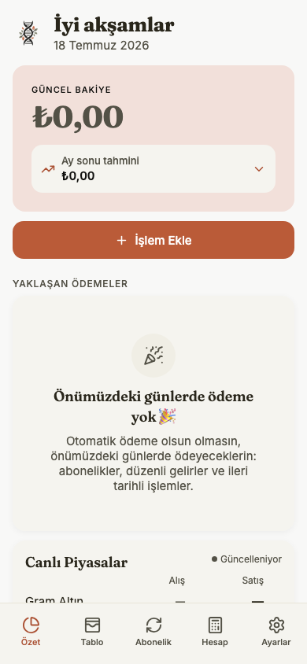
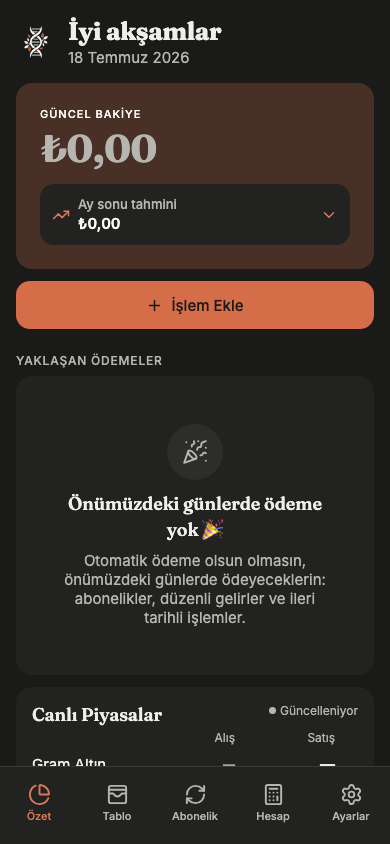
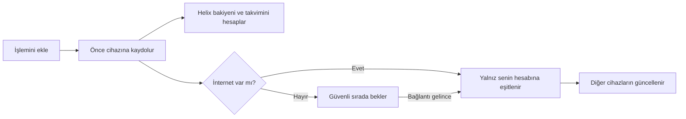
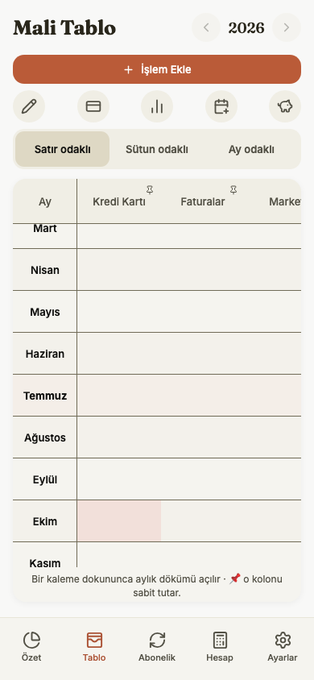
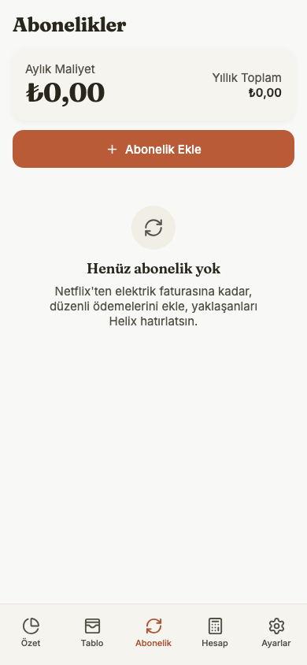
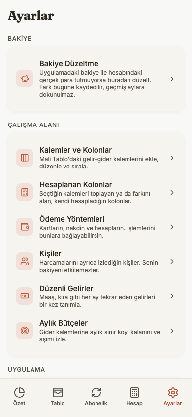
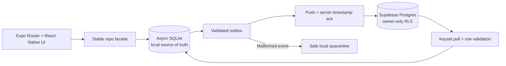

<div align="center">

<picture>
  <source media="(prefers-color-scheme: dark)" srcset="assets/brand/horizontal-dark.png">
  
</picture>

### Paran bugün nerede, yarın ne olacak—tek bakışta.

**Helix; nakit akışını, taksitlerini, aboneliklerini ve bütçelerini cihazında tutan,**
**internetsiz de çalışan kişisel finans alanıdır.**

*An offline-first personal finance workspace for cash flow, installments,
subscriptions and budgets—with a spreadsheet mind and a mobile heart.*

[](https://topraksv.github.io/helix/)

[](https://github.com/topraksv/helix/actions/workflows/deploy-web.yml)
[](https://docs.expo.dev/versions/v54.0.0/)
[](tsconfig.json)
[](docs/TESTING.md)
[](#lisans--license)

</div>

<p align="center">
  
  &nbsp;&nbsp;
  
</p>

## Helix neyi kolaylaştırır?

Bir tablo para takibi için güçlüdür; ama formül bozulduğunda, ileri tarihli bir
harcama bugünkü bakiyeye karıştığında veya bir taksidin kaçıncı ayda olduğunu
unuttuğunda yük tekrar sana döner. Helix tablonun tanıdık ay–kalem düzenini
korur; hesaplamayı, tekrarları ve veri güvenliğini ürünün sorumluluğu yapar.

| 30 saniyelik akış | Helix ne yapar? | Sana ne kalır? |
|---|---|---|
| **1 · Ekle** | Gelir, gider, taksit veya aboneliği tek formdan kaydeder. | Tutarı ve ne olduğunu söylemek. |
| **2 · Gör** | Bugünkü bakiye, ay tablosu, yaklaşan takvim ve bütçe durumunu birlikte hesaplar. | Karar vermek. |
| **3 · Güvende tut** | Önce cihazına yazar; bağlantı varsa yalnız hesabına eşitler. Silinen kayıtlar geri alınabilir. | İstersen yedek almak. |



Bu akışta ağ, uygulamayı kullanmanın ön koşulu değildir. Sync gecikir veya hata
verirse verin cihazında kalır; Ayarlar’daki **Cihazlarını Güncelle** satırı yalnız
eyleme dönük sonucu gösterir, teknik tanılama ayrıntısını kullanıcıya yüklemez.

## Her özellik bir görevin yanında

| İhtiyacın | Gideceğin yer | Yapabileceklerin |
|---|---|---|
| **Şu anki durumum ne?** | **Özet** | Güncel bakiye, ay sonu tahmini, yaklaşan ödemeler, o aya ait pasta/sütun grafikler ve canlı piyasalar |
| **Ay ay ayrıntı görmek** | **Mali Tablo** | Satır/sütun/ay odaklı matris, geçmiş–gelecek aylar, hücre detayı, analiz ve işlem arama |
| **Tekrarlayan ödemeleri izlemek** | **Abonelikler** | Aylık/yıllık maliyet, ödeme günü, deneme dönemi, yaklaşan kayıtlar |
| **Hızlı hesap ve kur dönüşümü** | **Hesap** | Dört işlem, TRY/USD/EUR/GBP dönüşümü, kaynak tarihli kur fallback’i |
| **Alanımı düzenlemek** | **Ayarlar** | Kalemler, hesaplanan kolonlar, kişiler, ödeme yöntemleri, aylık bütçeler, haftalık/iki haftalık/aylık gelirler |
| **Yakında ne var?** | **Özet → Yaklaşanlar** | Abonelik, düzenli gelir, ileri tarihli işlem ve kart ekstresini tek takvimde görmek |
| **Bir işlemi bulmak** | **Mali Tablo → Analiz** | Metin, tarih, tür, kategori ve ödeme yöntemiyle filtrelemek |
| **Verimi taşımak veya korumak** | **Ayarlar → Verilerini Taşı ve Koru** | JSON yedek/geri yükleme, CSV export, yönlendirilmiş Excel/CSV import |

<p align="center">
  
  &nbsp;
  
  &nbsp;
  
</p>

### Günlük kullanımın ötesinde

- Taksitler gerçek satın alma ve kart ekstresi dönemlerini korur; nakit etkisi
  satın alma gününde değil, kaydedilmiş son ödeme tarihinde oluşur.
- Haftalık, iki haftalık ve aylık düzenli gelirler; ay sonu taşmaları ve
  gerçekleşen/beklenen ayrımıyla üretilir.
- İzlenen kişilerin yükümlülükleri ayrı görünür; senin bakiyeni ve analizini
  değiştirmez.
- Aylık kategori bütçeleri kalan tutarı ve aşımı gösterir; bütçe verisi de sync
  ve yedek kapsamındadır.
- Para integer kuruş olarak saklanır. İade/ters işlem işareti korunur; kur
  bulunamadığında yabancı tutar TRY kabul edilmez.
- Silme, cihazlar arasında taşınan tombstone + geri alma akışıdır; kullanıcı
  kayıtları sessizce hard-delete edilmez.

## Verin nerede ve kim görebilir?

- **Local-only mod:** Supabase ayarı yoksa hesap açmadan çalışır; finansal veri
  cihazdaki SQLite veritabanında kalır.
- **Hesaplı mod:** Bağlantı olduğunda değişiklikler Supabase’e gider. Her tablo
  owner-only RLS ile korunur; başka hesap kendi istemcisinden satırlarını
  okuyamaz veya sahipliği değiştiremez.
- **Bildirimler:** İzin yalnız Ayarlar’dan istenir. Kilit ekranında finansal
  ayrıntı varsayılan olarak gizlidir ve ayrıntılı önizleme cihaz bazında ayrıca
  açılır.
- **Dış kaynaklar:** Piyasa/kur ve izin verilen favicon istekleri salt okunur,
  sınırlı ve doğrulanmış girdilerle yapılır.

Veri türleri, saklama, silme, export, üçüncü taraflar ve bilinen sınırlar için
[Gizlilik ve Veri Kullanımı](docs/PRIVACY.md) belgesine bak.

## Tasarım dili

Helix, Claude’un sıcak nötr ve kil paletini **Warm Organic Editorial** bir dille
birleştirir: Fraunces başlıklar, Inter gövde metni ve botanik çift sarmal işareti.
Light/dark roller ve kontrast sözleşmesi [theme.ts](src/ui/theme.ts) içinde tek
kaynaktır.

- Bütün dokunma alanları ortak primitive’lerden gelir; metin üç noktayla
  saklanmaz.
- Grafikler tam değerli ekran okuyucu özeti taşır; form hataları canlı
  duyurulur.
- Hareket spring tabanlıdır ve sistemin Reduced Motion tercihini izler.
- 320, 390, 768 ve 1440 px; light/dark baseline’ları Playwright tarafından
  release kapısında karşılaştırılır.

## Çalıştırma

> **Node 22 zorunlu.** Expo SDK 54 araç zinciri Node 24+ native TypeScript
> stripping ile uyumlu değildir.

```bash
git clone https://github.com/topraksv/helix.git
cd helix
npm ci
cp .env.example .env

npm run web                 # web development
npm run ios                 # iOS development build
```

`.env` içindeki Supabase URL ve anon key boş bırakılırsa Helix local-only açılır.
Sync için bir Supabase projesi bağlamak isteyen geliştirici, migration ve remote
doğrulama adımlarını [Release Sözleşmesi](docs/RELEASE.md) üzerinden izlemelidir.

### Kalite kapıları

```bash
npm run typecheck           # strict TS + checked index access
npm test                    # domain, sync, DB sınırı ve regression testleri
npx expo lint               # Expo/React lint
npm run test:e2e            # local-only static export + gerçek browser SQLite
```

Kalıcı senaryo matrisi, CI/manuel ayrımı ve cihaz kabul formu
[Test Sözleşmesi](docs/TESTING.md) içindedir. Sabit test sayısı dokümana yazılmaz;
GitHub Actions her PR’da o commit’in gerçek suite’ini çalıştırır.

## Teknik katman — merak edenler için

<details>
<summary><strong>Local-first mimariyi aç</strong></summary>



| Katman | Karar |
|---|---|
| Uygulama | Expo SDK 54, React Native 0.81, React 19, Expo Router |
| Tip sınırı | TypeScript strict + `noUncheckedIndexedAccess`; network/storage/import/DB girişlerinde runtime validation |
| Yerel veri | `expo-sqlite` async API + Drizzle `sqlite-proxy`; UI doğrudan SQL çağırmaz |
| Veri erişimi | [repo.ts](src/data/repo.ts) kararlı facade; odaklı implementasyonlar `src/data/repo/` altında |
| Sync | Atomik write + outbox, server-authoritative `updated_at`, keyset pull, LWW merge, dead-letter |
| Remote | Supabase Auth/PostgreSQL; owner-aware FK/constraint ve authenticated RLS policy’leri |
| Para/tarih | Integer minor units; `YYYY-MM-DD` local dates ve `YYYY-MM` month keys |
| Test | Vitest, remote pgTAP, Playwright + axe + responsive screenshot diff |

</details>

### Klasör haritası

```text
src/
├── app/        Expo Router ekranları ve route grupları
├── domain/     saf para, tarih, bakiye, recurrence ve analiz kuralları
├── db/         Drizzle şeması, async SQLite client ve local migration’lar
├── data/       live query’ler + kararlı repository facade
├── sync/       outbox, push/pull, session epoch ve dead-letter
├── services/   import/export, FX, piyasa, bildirim ve platform sınırları
├── auth/       Supabase oturumu, recovery ve cihaz kilidi
├── i18n/       kullanıcıya görünen bütün Türkçe metinler
└── ui/         ortak component, tablo, grafik, motion ve tema sistemi
```

Kalıcı mimari kurallar [AGENTS.md](AGENTS.md), yayın sırası
[docs/RELEASE.md](docs/RELEASE.md), denetim durumları
[docs/AUDIT_TRACKER.md](docs/AUDIT_TRACKER.md) içindedir.

## Platform ve bilinen sınırlar

- Web otomatik olarak GitHub Pages’e yayımlanır; iOS/Android OTA ayrı bir EAS
  Update adımıdır.
- iOS yerel cihaz build’i bu projenin doğrulanmış kurulu uygulama yoludur.
  Android kodu ve OTA paketi üretilir, ancak production store build/kabulü
  tamamlanmış sayılmaz.
- Native config, Expo SDK, icon/splash veya runtime değişikliği OTA ile
  teslim edilemez; yeniden cihaz build’i gerekir.
- Expo SDK 54 dependency advisory zinciri ve özellikle ertelenmiş ürün/teknoloji
  fikirleri [tracker backlog’unda](docs/AUDIT_TRACKER.md#açıkça-ertelenen-backlog)
  tutulur; tamamlanmış özellikler roadmap gibi yeniden listelenmez.

## Lisans / License

**Proprietary — all rights reserved.** © 2026 Ömer Toprak Şavlı.

Kaynak; şeffaflık ve inceleme için görünürdür, açık kaynak değildir. Yazılı izin
olmadan çalıştırma, kopyalama, değiştirme, dağıtma veya ticari kullanım hakkı
vermez. Tam koşullar [LICENSE](LICENSE) içindedir.
