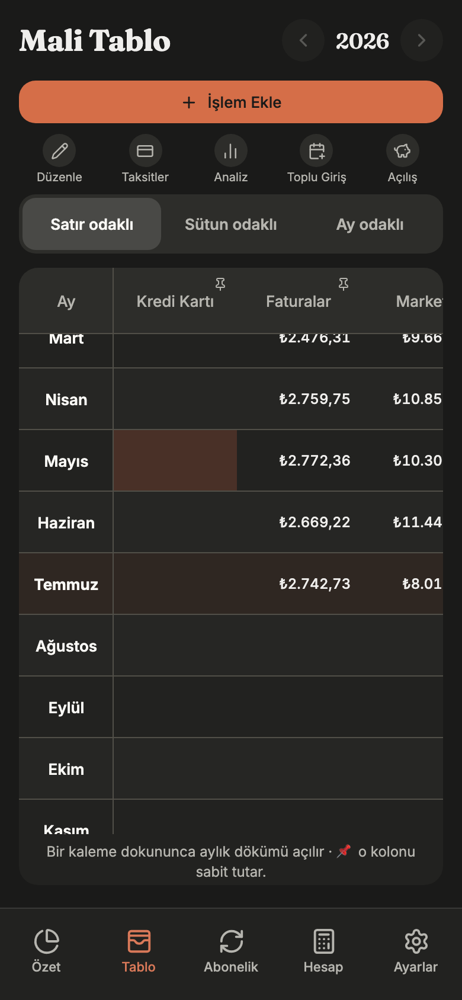
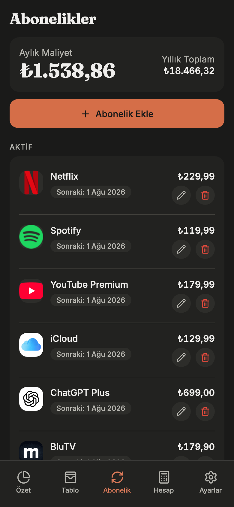
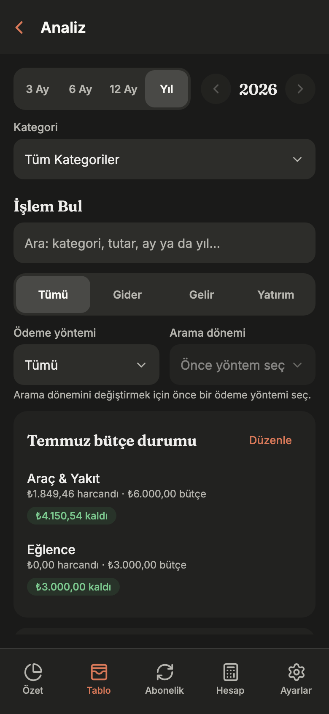

<div align="center">

<picture>
  <source media="(prefers-color-scheme: dark)" srcset="assets/brand/horizontal-dark.png">
  
</picture>

### Paran bugün nerede, yarın ne olacak — tek bakışta.

**Nakit akışını, taksitlerini, aboneliklerini ve bütçelerini cihazında tutan,**
**internetsiz de çalışan kişisel finans uygulaması.**

*An offline-first personal finance workspace for cash flow, installments,
subscriptions and budgets — with a spreadsheet mind and a mobile heart.*

[](https://topraksv.github.io/helix/)

[](https://github.com/topraksv/helix/actions/workflows/deploy-web.yml)
[](https://docs.expo.dev/versions/v54.0.0/)
[](#kurulum)
[](LICENSE)

</div>

<p align="center">
  
</p>

## Neden Helix?

Bir Excel tablosu para takibi için güçlüdür — ta ki formül bozulana, ileri
tarihli bir harcama bugünkü bakiyeye karışana ya da bir taksidin kaçıncı ayda
olduğunu unutana kadar. Helix, tablonun tanıdık **ay × kalem** düzenini korur;
hesaplamayı, tekrarları ve veri güvenliğini senin yerine üstlenir.

- **Ekle:** Gelir, gider, taksit veya aboneliği tek formdan kaydet. Tutarı
  "400+500" gibi bir toplam olarak bile yazabilirsin.
- **Gör:** Güncel bakiye, ay sonu tahmini, yaklaşan ödeme takvimi ve kategori
  bütçelerin tek özet ekranında birleşir.
- **Rahat ol:** Her kayıt önce cihazına yazılır; internet yokken de her şey
  çalışır. Bağlantı gelince yalnızca senin hesabına eşitlenir, silinenler tek
  dokunuşla geri alınır.

## Ekranlar

| Mali Tablo | Abonelikler | Analiz |
|:---:|:---:|:---:|
|  |  |  |
| Her ay × kalem hücresi düzenlenebilir; mevcut ay otomatik odaklanır. | Aylık/yıllık toplam maliyet, sonraki ödeme tarihi ve otomatik ödeme bir arada. | Dönem bazlı grafikler, kategori bütçe durumu ve tüm geçmişte işlem arama. |

## Neler yapabilirsin?

| İhtiyacın | Gideceğin yer | Yapabileceklerin |
|---|---|---|
| **Şu anki durumum ne?** | **Özet** | Güncel bakiye, ay sonu tahmini, yaklaşan ödemeler, aylık grafikler ve canlı altın–döviz fiyatları |
| **Ay ay ayrıntı** | **Mali Tablo** | Satır/sütun/ay odaklı matris, hücre detayı ve notları, toplu geçmiş girişi |
| **Tekrarlayan ödemeler** | **Abonelikler** | Aylık/yıllık maliyet, ödeme günü, deneme dönemi, otomatik ödeme |
| **Maaş ve düzenli gelirler** | **Ayarlar → Düzenli Gelirler** | Aylık, haftalık veya iki haftalık gelir kuralları; günü gelince onayla, gerçek tutarıyla işlensin |
| **Taksit ve kredi kartı** | **Mali Tablo → Taksitler** | Gerçek satın alma günü + ekstre dönemi; nakit etkisi son ödeme tarihinde |
| **Bütçe hedefleri** | **Ayarlar → Bütçeler** | Kategori başına aylık hedef, kalan tutar ve aşım uyarısı |
| **Hızlı hesap ve kur** | **Hesap** | Hesap makinesi + canlı kurla TRY/USD/EUR/GBP dönüşümü |
| **Bir işlemi bulmak** | **Mali Tablo → Analiz** | Metin, tutar, tür, kategori ve ödeme yöntemiyle arama |
| **Verini taşımak** | **Ayarlar** | JSON yedek/geri yükleme, CSV dışa aktarma, sihirbazlı Excel içe aktarma |

## Local-first çalışma modeli

Her yazma önce cihazdaki SQLite veritabanına, veri ve outbox kaydı tek
transaction olacak şekilde iner. Uygulama çevrimdışıyken tam işlevlidir; bağlantı
geldiğinde outbox Supabase'e gönderilir ve sunucunun normalize ettiği `updated_at`
cevabı beklenir. Silme işlemleri tombstone'dur, bu yüzden geri alınabilir ve
cihazlar arasında tutarlı kalır. Bozuk veya yabancı satırlar cursor'ı ilerletmez;
`sync_dead_letters` içine karantinaya alınır.

Supabase yapılandırılmazsa uygulama **hesapsız (local-only)** açılır ve hiçbir
finansal veri dışarı çıkmaz.

## Platformlar

| Platform | Durum |
|---|---|
| Web | Her `main` push'unda GitHub Pages'e otomatik yayımlanır — [canlı sürüm](https://topraksv.github.io/helix/) |
| iOS | Yerel cihaz build'i (`npx expo run:ios --device`, ücretsiz Apple ID); JS/asset değişiklikleri EAS Update ile gider |
| Android | Paket yapılandırması ve OTA bundle'ı var; imzalı production store build'i ve fiziksel kabul **henüz yapılmadı** |

Native modül, ikon, SDK veya runtime değişiklikleri OTA ile teslim edilemez;
yeniden cihaz build'i gerektirir.

## Mimari özet

| Katman | Karar |
|---|---|
| Uygulama | Expo SDK 54, React Native 0.81, React 19, Expo Router |
| Yerel veri | `expo-sqlite` (async) + Drizzle; UI doğrudan SQL çağırmaz |
| Veri erişimi | [`src/data/repo.ts`](src/data/repo.ts) kararlı facade; implementasyonlar `src/data/repo/` altında |
| Saf mantık | `src/domain/` — para, tarih, bakiye, taksit, recurrence; React ve I/O içermez |
| Sync | Atomik yazım + outbox, server-authoritative `updated_at`, dead-letter karantinası |
| Remote | Supabase Auth/Postgres; owner-only RLS |
| Para/tarih | Integer kuruş; `YYYY-MM-DD` tarih, `YYYY-MM` ay anahtarları |
| Arayüz | Ortak primitive'ler + tek tema kaynağı ([`src/ui/theme.ts`](src/ui/theme.ts)) |

Ayrıntı: [Mimari](docs/ARCHITECTURE.md).

## Tasarım

Sıcak kâğıt tonları üzerinde kil vurgusu: **Warm Organic Editorial**. Fraunces
başlıklar, Inter gövde, botanik çift sarmal logosu. Gelirler yeşil, giderler
kırmızı; light/dark tüm rol çiftleri otomatik kontrast sözleşmesinden geçer.
Metinler asla üç noktayla kırpılmaz, hareket sistemi Reduced Motion tercihine
uyar, grafikler ekran okuyucu için tam değerli özet taşır.

## Gizlilik ve güvenlik

- **Hesapsız mod:** Bütün finansal veri cihazındaki SQLite veritabanında kalır.
- **Hesaplı mod:** Değişiklikler yalnızca senin hesabına eşitlenir. Her tablo
  owner-only RLS ile korunur; başka bir hesap satırlarını okuyamaz.
- **Anahtarlar:** Client yalnız publishable anon anahtarı taşır; service-role
  anahtarı yalnızca GitHub Actions secret'ındadır.
- **Bildirimler:** İzin yalnızca Ayarlar'dan istenir; kilit ekranında finansal
  ayrıntı varsayılan olarak gizlidir.
- **Dış istekler:** Kur, piyasa ve logo istekleri salt okunur; boyut, şekil,
  tarih ve host doğrulamasından geçer.
- **Loglama:** Production'da token, tutar, not veya e-posta persist edilmez.

Kullanıcı tarafı: [Gizlilik ve Veri Kullanımı](docs/PRIVACY.md).
Mühendislik tarafı: [Güvenlik Modeli](docs/SECURITY.md).

## Kurulum

> **Node 22 zorunlu.** Expo SDK 54 araç zinciri Node 24+ ile uyumlu değildir.

```bash
git clone https://github.com/topraksv/helix.git
cd helix
npm ci
cp .env.example .env     # boş bırakılırsa uygulama local-only açılır

npm run web              # web development
npm run ios              # iOS development build
```

Kalite kapısı tek komuttur:

```bash
npm run verify           # typecheck + Vitest + lint
npm run verify:release   # + production export, bundle bütçesi, Playwright
```

Aynı adımlar her PR'da GitHub Actions'ın `quality` job'unda koşar; `main`'e
ancak hepsi geçtiğinde web yayımlanır. Katman katman senaryo matrisi ve cihaz
kabul listesi [Test Sözleşmesi](docs/TESTING.md)ndedir.

## Teslim modeli

`main`'e push **yalnızca web'i** yayımlar. Kurulu mobil uygulama ayrı bir EAS
Update ile güncellenir; native değişiklikler ise yeniden cihaz build'i ister.
Kanıt gereksinimleri, Supabase migration sırası ve rollback prosedürü
[Release Sözleşmesi](docs/RELEASE.md)ndedir.

## Belgeler

| Belge | İçerik |
|---|---|
| [docs/ARCHITECTURE.md](docs/ARCHITECTURE.md) | Yapı, veri akışı, sınırlar, tasarım dili, reddedilen yaklaşımlar |
| [docs/TESTING.md](docs/TESTING.md) | Kalite komutları, test katmanları, cihaz kabul matrisi |
| [docs/RELEASE.md](docs/RELEASE.md) | Branch, PR kapısı, Pages, OTA, native build, Supabase, rollback |
| [docs/SECURITY.md](docs/SECURITY.md) | Güven sınırları, RLS, secret yönetimi, doğrulama matrisi |
| [docs/PRIVACY.md](docs/PRIVACY.md) | Hangi veri nerede, üçüncü taraf istekleri, saklama ve silme |
| [AGENTS.md](AGENTS.md) | Kodlama ajanları için kalıcı kurallar |

## Lisans / License

**Proprietary — all rights reserved.** © 2026 Ömer Toprak Şavlı.

Kaynak; şeffaflık ve inceleme için görünürdür, açık kaynak değildir. Yazılı izin
olmadan çalıştırma, kopyalama, değiştirme, dağıtma veya ticari kullanım hakkı
vermez. Tam koşullar [LICENSE](LICENSE) içindedir.
