<div align="center">

<picture>
  <source media="(prefers-color-scheme: dark)" srcset="assets/brand/horizontal-dark.png">
  
</picture>

### Paran bugün nerede, ay sonunda nerede olacak — tek ekranda.

**Nakit akışını, taksitlerini, aboneliklerini ve yatırımlarını cihazında tutan,**
**internetsiz de tam çalışan kişisel finans uygulaması.**

*An offline-first personal finance workspace for cash flow, installments,
subscriptions and investments — with a spreadsheet's mind and a phone's manners.*

<a href="https://topraksv.github.io/helix/"></a>

[](https://github.com/topraksv/helix/actions/workflows/ci.yml)
[](https://docs.expo.dev/versions/v54.0.0/)
[](#geliştirici-kurulumu)
[](LICENSE)

<br>

<p>
  <picture><source media="(prefers-color-scheme: dark)" srcset="assets/screenshots/m-dashboard-dark.png">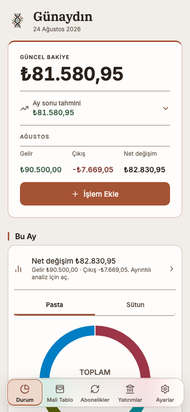</picture>
  <picture><source media="(prefers-color-scheme: dark)" srcset="assets/screenshots/m-cashflow-dark.png">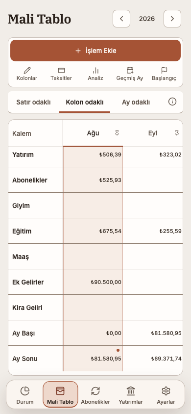</picture>
  <picture><source media="(prefers-color-scheme: dark)" srcset="assets/screenshots/m-subscriptions-dark.png">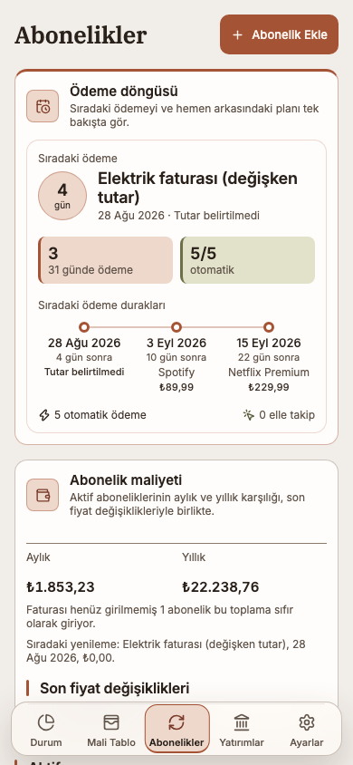</picture>
</p>

<sub>Ekran görüntüleri gerçek uygulamadan, tamamı sentetik iki yıllık bir veri kümesiyle alındı. Sistem temanıza göre açık/koyu görünür.</sub>

</div>

---

## Helix ne yapar?

Excel para takibi için güçlüdür — formül bozulana, ileri tarihli bir harcama
bugünkü bakiyeye karışana ya da bir taksidin kaçıncı ayda olduğunu unutana
kadar. Helix o tablonun tanıdık **ay × kalem** düzenini korur, hesabı ve
tekrarları üstlenir.

Üç cümlede:

- **Bugünü söyler.** Güncel bakiye, bu ayın giriş-çıkışı, yaklaşan ödemeler.
- **Yarını söyler.** Ay sonu tahmini; taksitler, abonelikler ve düzenli
  gelirler aylara kendiliğinden dağılır.
- **Yanlış söylemez.** Aynı rakam iki ekranda aynı çıkar; bir satır kendi
  içinde toplanır. Hesaplanmayan bir şey boş bırakılmaz, sıfır da gizlenmez.

Hesap açmak zorunlu değil. Supabase yapılandırılmazsa uygulama **hesapsız**
açılır ve hiçbir finansal veri cihazdan çıkmaz.

---

## İş başında

<table>
<tr>
<td align="center" width="33%"><picture><source media="(prefers-color-scheme: dark)" srcset="assets/screenshots/m-month-dark.png">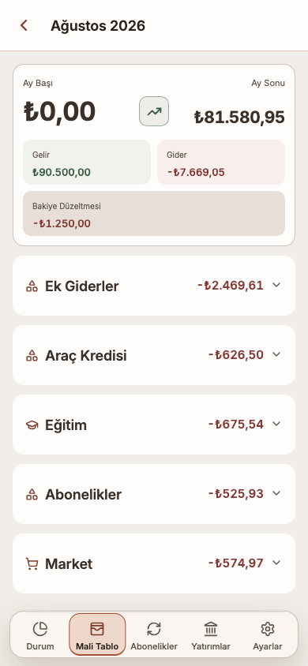</picture></td>
<td align="center" width="33%"><picture><source media="(prefers-color-scheme: dark)" srcset="assets/screenshots/m-analytics-dark.png">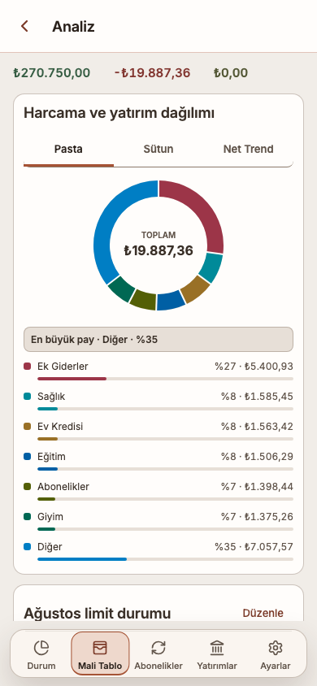</picture></td>
<td align="center" width="33%"><picture><source media="(prefers-color-scheme: dark)" srcset="assets/screenshots/m-investments-dark.png">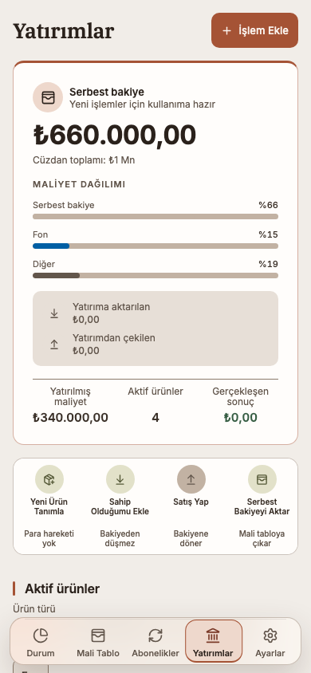</picture></td>
</tr>
<tr>
<td align="center"><b>Ayın hikâyesi</b><br><sub>Ay başından ay sonuna ne olduğu, kalem kalem. Bakiye düzeltmesi ayrı satır — akışa karışmaz.</sub></td>
<td align="center"><b>Nereye gitti?</b><br><sub>Dönem, kategori, ödeme yöntemi ve serbest metinle ara. Halkaya dokun: kategori kilitlenir.</sub></td>
<td align="center"><b>Yatırım cüzdanı</b><br><sub>Serbest nakit, yatırılmış maliyet, gerçekleşen sonuç. Mali Tablo hareketleri burada tekrar sayılmaz.</sub></td>
</tr>
<tr>
<td align="center"><picture><source media="(prefers-color-scheme: dark)" srcset="assets/screenshots/m-transaction-dark.png">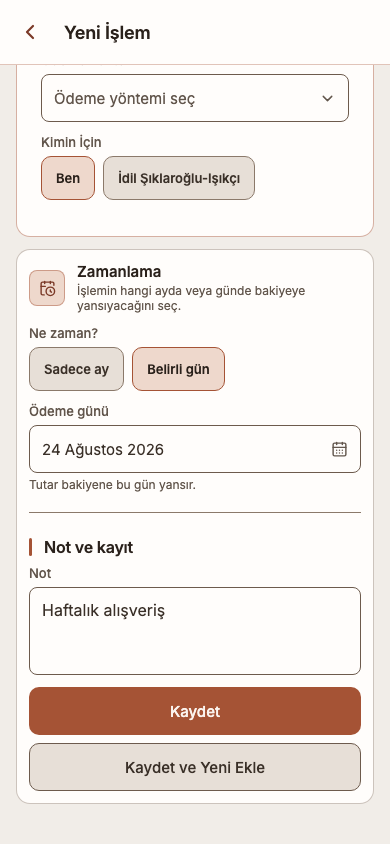</picture></td>
<td align="center"><picture><source media="(prefers-color-scheme: dark)" srcset="assets/screenshots/m-installments-dark.png">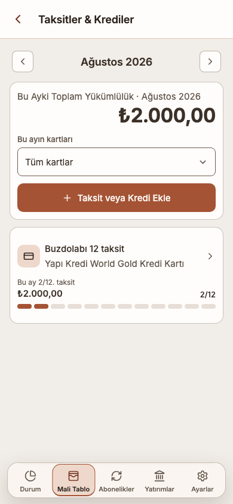</picture></td>
<td align="center"><picture><source media="(prefers-color-scheme: dark)" srcset="assets/screenshots/m-calendar-dark.png">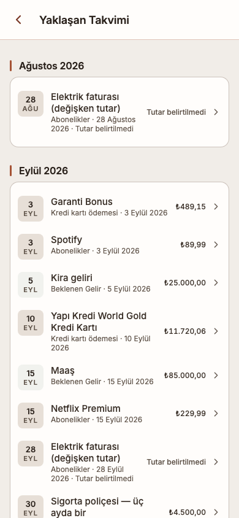</picture></td>
</tr>
<tr>
<td align="center"><b>Tek form</b><br><sub>Gider, gelir ya da yatırım. Tutar alanı toplama yapar: <code>400+500</code> yazabilirsin.</sub></td>
<td align="center"><b>Taksit ve kredi</b><br><sub>Gerçek alışveriş günü ile ekstre dönemi ayrı; nakde etkisi son ödeme tarihinde.</sub></td>
<td align="center"><b>Yaklaşanlar</b><br><sub>Abonelik, düzenli gelir ve kart ekstresi bir takvimde. Ödendi/Alındı tek dokunuş.</sub></td>
</tr>
</table>

<details>
<summary><b>Masaüstünde de aynı uygulama</b> — aynı kod, aynı veriler, geniş ekran düzeni</summary>
<br>
<picture>
  <source media="(prefers-color-scheme: dark)" srcset="assets/screenshots/d-dashboard-dark.png">
  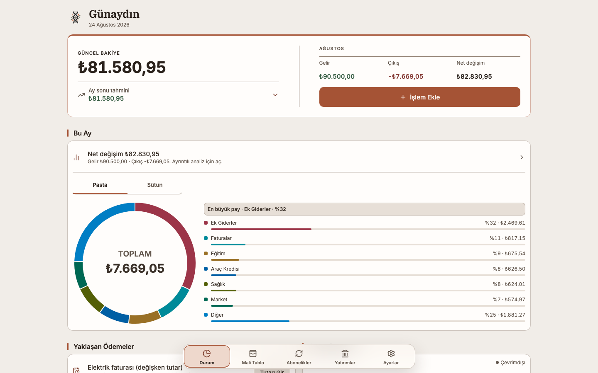
</picture>
<br><br>
<picture>
  <source media="(prefers-color-scheme: dark)" srcset="assets/screenshots/d-cashflow-dark.png">
  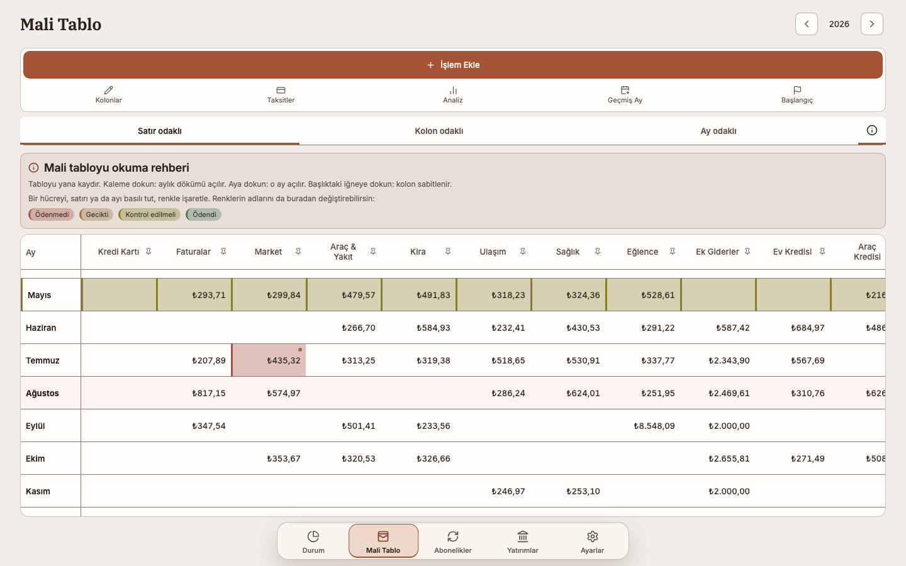
</picture>
</details>

---

## Nereye bakacaksın?

| İhtiyacın | Gideceğin yer | Bulacakların |
|---|---|---|
| **Şu an durum ne?** | **Durum** | Güncel bakiye, ay sonu tahmini, yaklaşan ödemeler, ayın dağılımı, canlı altın ve döviz |
| **Ay ay ayrıntı** | **Mali Tablo** | Satır / kolon / ay odaklı matris; hücreye dokun, o ayın o kalemi açılır |
| **Tekrarlayan ödemeler** | **Abonelikler** | Aylık ve yıllık maliyet, sıradaki duraklar, deneme dönemi, otomatik ödeme |
| **Değişken faturalar** | **Abonelikler** | Tutarı bilinmeyen fatura sıfır sayılmaz; geçmişinden beklenen aralık gösterilir |
| **Yatırımlar** | **Yatırımlar** | Serbest nakit, ürün bazında ortalama maliyet, gerçekleşen kâr/zarar, hedef ağırlık |
| **Taksit ve kredi kartı** | **Mali Tablo → Taksitler** | Plan başına kaçıncı taksit, bu ayki toplam yükümlülük, kart bazında ayrım |
| **Maaş ve düzenli gelir** | **Ayarlar → Düzenli Gelirler** | Aylık / haftalık / iki haftalık kurallar; günü gelince onayla, gerçek tutarıyla işlenir |
| **Harcama sınırı** | **Ayarlar → Aylık Harcama Limiti** | Kalem başına aylık limit, kalan tutar ve aşım |
| **Bir işlemi bulmak** | **Mali Tablo → Analiz** | Metin, tutar, tür, kategori ve ödeme yöntemiyle arama |
| **Karar bekleyenler** | **Bekleyenler** | Onay bekleyen ödemeler, biten denemeler, bakiye kontrolü — bitince satır kaybolur |
| **Hesap ve kur** | **Ayarlar → Hızlı Hesaplamalar** | Hesap makinesi ve 22 para birimi arasında çevirici |
| **Verini taşımak** | **Ayarlar** | JSON yedek/geri yükleme, CSV çıktısı, sihirbazlı Excel/CSV içe aktarma, PDF ekstre okuma |

---

## Neden cihazda?

Her yazma önce cihazdaki SQLite veritabanına iner — veri satırı ve outbox kaydı
**tek transaction** içinde. Uygulama çevrimdışıyken eksiksiz çalışır; bağlantı
geldiğinde outbox Supabase'e gönderilir ve sunucunun normalize ettiği
`updated_at` cevabı beklenir.

- **Silme geri alınabilir.** Silmeler tombstone'dur, cihazlar arasında tutarlı
  kalır, tek dokunuşla geri döner.
- **Bozuk satır kuyruğu tıkamaz.** Reddedilen kayıt cursor'ı ilerletmez;
  `sync_dead_letters` içinde karantinaya alınır ve ne olduğu ekranda yazılır.
- **Hesapsız mod tam moddur.** Supabase yoksa uygulama eksiksiz çalışır, veri
  cihazdan çıkmaz.

Eşitleme çalışırken uygulama beklemez: yazma önce cihaza gider, ekran anında
güncellenir, gönderim arkada sırasını bekler.

---

## Platformlar

| Platform | Durum |
|---|---|
| **Web** | [Canlı sürüm](https://topraksv.github.io/helix/) — yetkilendirilmiş bir `main` push'unda risk sınıflandırıcı web yüzeyini seçtiğinde otomatik yayımlanır |
| **iOS / Android** | Expo Go ile açılan EAS `preview` update'i. **Fiziksel cihaz kabulü henüz yapılmadı**; tarayıcı testleri native SQLite, Keychain, bildirim izni, biyometri ve app-switcher görüntüsünü kanıtlamaz |

EAS Build, development client, TestFlight ve store submission bu teslim yolunun
parçası **değil**. Mobil kullanım Expo Go'nun SDK 54 ile sunduğu native
kütüphanelerle sınırlı.

---

## Tasarım

Sıcak nötrler üzerinde tek bir vurgu rengi; üç palet, iki tema, hepsi ölçülmüş.

- **Palet:** Amber (kil), Petrol (mineral mavi), Servi (taş ve koyu yeşil).
  Ayarlar'dan anında değişir, seçim cihazda kalır.
- **Renk anlam taşır, süs değil.** Gelir yeşil, gider kırmızı, uyarı amber —
  tema ve palet değişse de aynı. Grafik kategorileri de açık ve koyu temada
  aynı ton ailesinde kalır, akşam olunca renk değiştirmez.
- **Tipografi:** yoğun içerik Inter, marka başlıkları ve büyük toplamlar IBM
  Plex Serif. Türkçe büyük harf `tr-TR` kurallarıyla — `GÜNCEL BAKİYE`, `NİSAN`.
- **Erişilebilirlik ölçülür.** Metin kontrastı iki temada da bileşik arka plana
  karşı hesaplanır; hareket azaltma tercihi her animasyon ailesini kapatır;
  Mali Tablo ok tuşlarıyla gezilir ve tek sekme durağıdır.
- **Kırpma yok.** Uzun bir kalem adı üç noktayla kesilmez; daralır, sarar ya da
  erişilebilir etikette tam adını korur.

Her ekran aynı iskeleti kullanır: bir başlık, kartlar hâlinde bölümler, ve
satır anatomisi her listede aynı — mark, ad, değer, eylem.

---

## Gizlilik ve güvenlik

- **Hesapsız mod:** bütün finansal veri cihazdaki SQLite dosyasında kalır.
- **Hesaplı mod:** her tablo owner-only RLS ile korunur; yetki sınırı sunucudadır,
  istemci kontrolü değildir.
- **Anahtarlar:** istemci yalnız publishable anon anahtarı taşır.
- **Dış istekler:** kur, piyasa ve logo istekleri salt okunur; boyut, şekil,
  tarih ve host doğrulamasından geçer.
- **Loglama:** production'da token, tutar, not veya e-posta persist edilmez.
- **Hata mesajları** yer söyler, değer söylemez: reddedilen bir yedek hangi
  bölümün kaçıncı kaydında hangi kurala takıldığını yazar; tutarı yazmaz.

---

## Geliştirici kurulumu

> **Node 22 zorunlu** (`.nvmrc`) — Expo SDK 54'ün derleyip test ettiği sürüm.

```bash
git clone https://github.com/topraksv/helix.git
cd helix
npm ci
cp .env.example .env             # boş bırakılırsa uygulama hesapsız açılır

npm run web                      # tarayıcıda geliştirme
npx expo start --tunnel --clear  # Expo Go için QR
```

### Kalite kapısı

```bash
npm run verify        # typecheck + kapsamlı Vitest + lint
npm run test:e2e      # Playwright: tarayıcı senaryolarının tamamı
npm run verify:full   # + production export, bundle bütçesi, tüm Playwright
```

CI, bir push'un dokunduğu yolları okur ve testin ağırlığını ona göre seçer:
ekran görüntüsü değiştiyse hızlı kontrol, para hesabına dokunulduysa
tarayıcı senaryolarının tamamı ve mutasyon testi. Mutasyon testi kodu kasıtlı
olarak bozar ve testlerin bunu fark edip etmediğini ölçer;
`mutation-baseline.json` her dosyanın en son ne kadarını yakaladığını tutar.

### Kod haritası

| Klasör | Sorumluluk |
|---|---|
| `src/app/` | Expo Router rotaları ve ekran orkestrasyonu — ham SQL değil. Yaprak katman: kimse rotaları import etmez |
| `src/domain/` | Saf hesap ve kurallar — para, tarih, bakiye zinciri, tekrarlar. React'sız, testlenebilir |
| `src/data/` | `repo.ts` kalıcılık cephesi + canlı sorgu hook'ları. Rotalar `repo/*` içine girmez |
| `src/db/` | Şema, migration'lar, atomik yazma katmanı |
| `src/sync/` | Outbox, merge politikası, oturum epoch'u, karantina |
| `src/services/` | Yan etkili entegrasyonlar: dosya, bildirim, piyasa, PDF, Excel |
| `src/ui/` | Tasarım sistemi ilkelleri ve tokenlar |

Bağımlılık yönü `app → data → db` ve `app → domain`. Rotalar ve UI
`src/data/repo/*` içine girmez; `src/domain/` React, ağ ve depolama içermez —
bu yüzden hesap kısmı tarayıcısız, veritabanısız test edilebilir.
`tests/architecture-contract.test.ts` bunu her çalıştırmada doğrular.

---

## Lisans / License

**Proprietary — all rights reserved.** © 2026 Ömer Toprak Şavlı.

Kaynak; şeffaflık ve inceleme için görünürdür, açık kaynak değildir. Yazılı izin
olmadan çalıştırma, kopyalama, değiştirme, dağıtma veya ticari kullanım hakkı
vermez. Tam koşullar [LICENSE](LICENSE) içinde.
