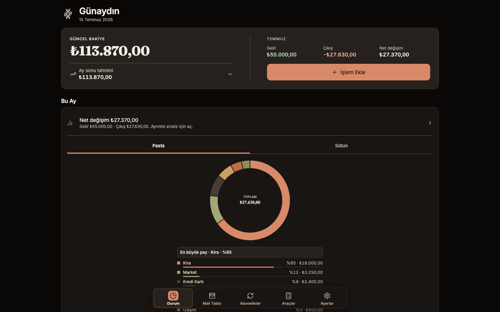
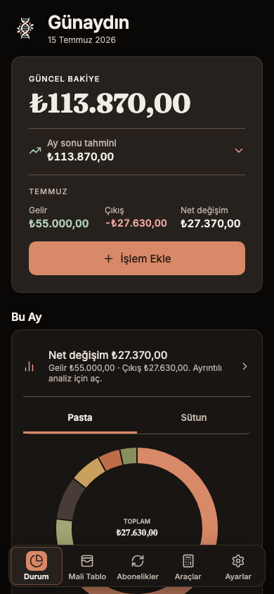
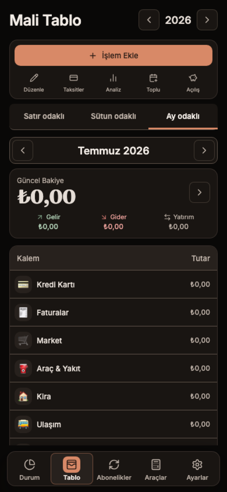
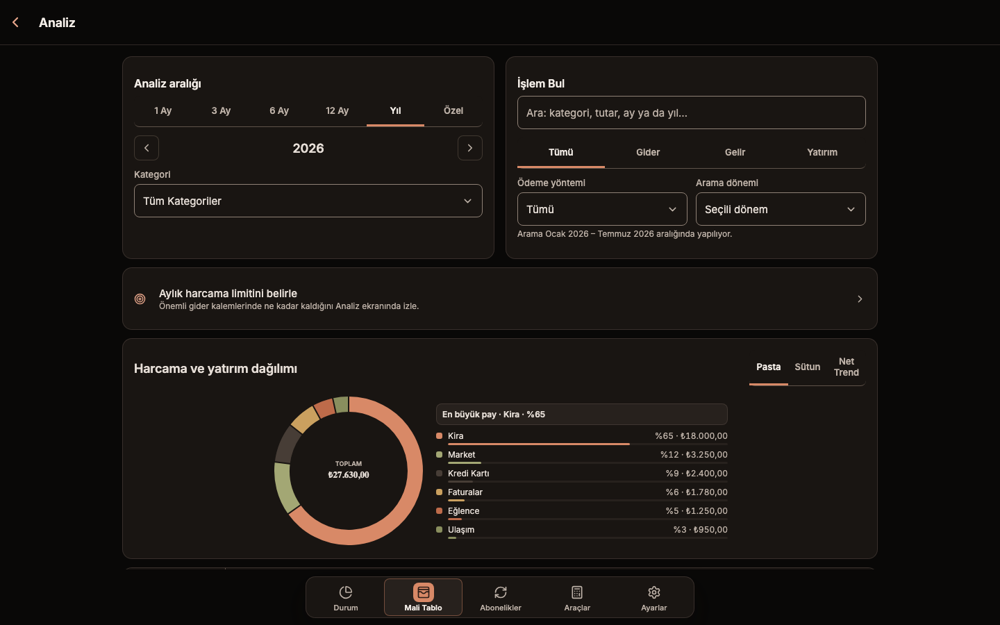
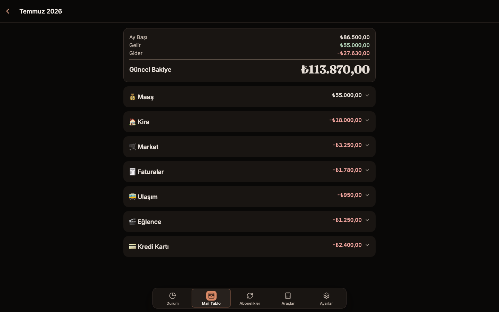

<div align="center">

<picture>
  <source media="(prefers-color-scheme: dark)" srcset="assets/brand/horizontal-dark.png">
  
</picture>

### Paran bugün nerede, yarın ne olacak — tek bakışta.

**Nakit akışını, taksitlerini, aboneliklerini ve bütçelerini cihazında tutan,**
**internetsiz de çalışan kişisel finans uygulaması.**

*An offline-first personal finance workspace for cash flow, installments,
subscriptions and budgets — with a spreadsheet mind and a mobile heart.*

[](https://topraksv.github.io/helix/)

[](https://github.com/topraksv/helix/actions/workflows/ci.yml)
[](https://docs.expo.dev/versions/v54.0.0/)
[](#kurulum)
[](LICENSE)

</div>

<p align="center">
  
  
</p>

## Neden Helix?

Bir Excel tablosu para takibi için güçlüdür — ta ki formül bozulana, ileri
tarihli bir harcama bugünkü bakiyeye karışana ya da bir taksidin kaçıncı ayda
olduğunu unutana kadar. Helix, tablonun tanıdık **ay × kalem** düzenini korur;
hesaplamayı, tekrarları ve veri güvenliğini senin yerine üstlenir.

- **Ekle:** Gelir, gider, taksit veya aboneliği tek formdan kaydet. Tutarı
  "400+500" gibi bir toplam olarak bile yazabilirsin.
- **Gör:** Güncel bakiye, ay sonu tahmini, yaklaşan ödeme takvimi ve kategori
  bütçelerin tek özet ekranında birleşir.
- **Rahat ol:** Her kayıt önce cihazına yazılır; internet yokken de her şey
  çalışır. Bağlantı gelince yalnızca senin hesabına eşitlenir, silinenler tek
  dokunuşla geri alınır.

## Helix iş başında

| Mali Tablo | Analiz | İşlem yönetimi |
|:---:|:---:|:---:|
|  |  |  |
| Satır, kolon veya ay odağında incele; hücreden ayrıntıya in. | Dönem, kategori ve ödeme yöntemiyle karşılaştır veya işlem ara. | Ayın gelir-gider hareketlerini toplu gör; kaleme dokunup düzenle. |

> Görseller, 15 Temmuz 2026'ya sabitlenmiş ve yalnızca sentetik veriler kullanan
> deterministik demo senaryosundan üretildi. Gerçek kullanıcı verisi içermez.

## Neler yapabilirsin?

| İhtiyacın | Gideceğin yer | Yapabileceklerin |
|---|---|---|
| **Şu anki durumum ne?** | **Durum** | Güncel bakiye, ay sonu tahmini, yaklaşan ödemeler, aylık grafikler ve canlı altın–döviz fiyatları |
| **Ay ay ayrıntı** | **Mali Tablo** | Satır/kolon/ay odaklı matris, hücre detayı ve notları, toplu geçmiş girişi |
| **Tekrarlayan ödemeler** | **Abonelikler** | Aylık/yıllık maliyet, ödeme günü, deneme dönemi, otomatik ödeme |
| **Maaş ve düzenli gelirler** | **Ayarlar → Düzenli Gelirler** | Aylık, haftalık veya iki haftalık gelir kuralları; günü gelince onayla, gerçek tutarıyla işlensin |
| **Taksit ve kredi kartı** | **Mali Tablo → Taksitler** | Gerçek satın alma günü + ekstre dönemi; nakit etkisi son ödeme tarihinde |
| **Bütçe hedefleri** | **Ayarlar → Bütçeler** | Kategori başına aylık hedef, kalan tutar ve aşım uyarısı |
| **Hızlı hesap ve kur** | **Araçlar** | Hesap makinesi + canlı kurla TRY/USD/EUR/GBP dönüşümü |
| **Bir işlemi bulmak** | **Mali Tablo → Analiz** | Metin, tutar, tür, kategori ve ödeme yöntemiyle arama |
| **Verini taşımak** | **Ayarlar** | JSON yedek/geri yükleme, CSV dışa aktarma, sihirbazlı Excel içe aktarma |

## Local-first çalışma modeli

Her yazma önce cihazdaki SQLite veritabanına, veri ve outbox kaydı tek
transaction olacak şekilde iner. Uygulama çevrimdışıyken tam işlevlidir; bağlantı
geldiğinde outbox Supabase'e gönderilir ve sunucunun normalize ettiği `updated_at`
cevabı beklenir. Silme işlemleri tombstone'dur, bu yüzden geri alınabilir ve
cihazlar arasında tutarlı kalır. Bozuk veya yabancı satırlar cursor'ı ilerletmez;
`sync_dead_letters` içine karantinaya alınır.

Supabase yapılandırılmazsa uygulama **hesapsız (local-only)** açılır ve hiçbir
finansal veri dışarı çıkmaz.

## Platformlar

| Platform | Durum |
|---|---|
| Web | GitHub Pages'teki [canlı sürüm](https://topraksv.github.io/helix/) yalnız açıkça yetkilendirilmiş manuel release ile güncellenir |
| iOS / Android | Yetkilendirilmiş EAS `preview` update'i Expo Go ile açılır; fiziksel cihaz kabulü **henüz yapılmadı** |

Mobil kullanım Expo Go'nun SDK 54 içinde sunduğu native kütüphanelerle sınırlıdır.
EAS Build, development client, TestFlight ve store submission bu teslim yolunun
parçası değildir; fiziksel cihazda açılış yapılmadan cihaz kabulü doğrulanmış
sayılmaz.

## Tasarım

Sıcak kâğıt tonları üzerinde kil vurgusu: **Warm Organic Editorial**. Fraunces
başlıklar, Inter gövde, botanik çift sarmal logosu. Gelirler yeşil, giderler
kırmızı; light/dark tüm rol çiftleri otomatik kontrast sözleşmesinden geçer.
Uzun Mali Tablo kalemleri yalnız dar hücrede tek satır kısalır ve erişilebilir
etikette tam adı korur. Hareket sistemi Reduced Motion tercihine uyar; grafikler
ekran okuyucu için tam değerli özet taşır.

## Gizlilik ve güvenlik

- **Hesapsız mod:** Bütün finansal veri cihazındaki SQLite veritabanında kalır.
- **Hesaplı mod:** Değişiklikler yalnızca senin hesabına eşitlenir. Her tablo
  owner-only RLS ile korunur; başka bir hesap satırlarını okuyamaz.
- **Anahtarlar:** Client yalnız publishable anon anahtarı taşır; service-role
  anahtarı yalnızca GitHub Actions secret'ındadır.
- **Bildirimler:** İzin yalnızca Ayarlar'dan istenir; kilit ekranında finansal
  ayrıntı varsayılan olarak gizlidir.
- **Dış istekler:** Kur, piyasa ve logo istekleri salt okunur; boyut, şekil,
  tarih ve host doğrulamasından geçer.
- **Loglama:** Production'da token, tutar, not veya e-posta persist edilmez.

## Kurulum

> **Node 22 zorunlu.** Expo SDK 54 araç zinciri Node 24+ ile uyumlu değildir.

```bash
git clone https://github.com/topraksv/helix.git
cd helix
npm ci
cp .env.example .env     # boş bırakılırsa uygulama local-only açılır

npm run web              # web development
npx expo start --tunnel --clear  # Expo Go QR
```

Kalite kapısı tek komuttur:

```bash
npm run verify           # typecheck + Vitest + lint
npm run test:e2e:smoke   # kritik tarayıcı senaryoları
npm run verify:full      # + production export, bundle bütçesi, tüm Playwright
```

GitHub Actions `main` push'unda kalite, web export/bütçe ve smoke E2E'yi koşar;
tam browser paketi nightly veya açıkça istenen çalıştırmada üç shard'a bölünür.
Yayın ayrı, hedefi belirtilmiş manuel dispatch ister.

## Teslim modeli

`main`'e push kalite kapısını çalıştırır, yayınlamaz. Yetkilendirilmiş web
dispatch'i aynı koşuda export edilip bütçesi ölçülen immutable artefaktı;
yetkilendirilmiş mobile dispatch'i aynı commit'i sabit EAS CLI ile `preview`
branch'ine yollar. Hiçbir binary oluşturulmaz. Ayrıntı ve rollback sınırı
[`docs/RELEASE.md`](docs/RELEASE.md) belgesindedir.

## Lisans / License

**Proprietary — all rights reserved.** © 2026 Ömer Toprak Şavlı.

Kaynak; şeffaflık ve inceleme için görünürdür, açık kaynak değildir. Yazılı izin
olmadan çalıştırma, kopyalama, değiştirme, dağıtma veya ticari kullanım hakkı
vermez. Tam koşullar [LICENSE](LICENSE) içindedir.
