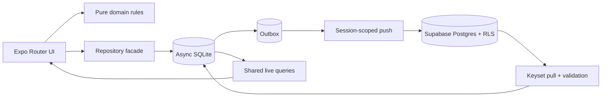

# HELIX — Bağımsız Tam Denetim

**Tarih:** 17 Temmuz 2026

**Dal / HEAD:** `main` · `115baf8c192f69392a1813980cac4c02880e39cb`

**Mod:** Salt-okunur; dosya, paket, migration, commit, deploy ve production verisi değiştirilmedi.

**Güven:** Kesin = doğrudan kod/config/test/remote kanıtı · Yüksek = güçlü kod kanıtı, cihaz doğrulaması eksik · Orta = teknik çıkarım · Düşük = bağlam eksik · Doğrulanamadı = erişim yok.

| Git bütünlüğü | `git status --short` |
|---|---|
| Başlangıç | Boş |
| Bitiş | Boş |
| Karşılaştırma | Aynı; HEAD değişmedi, denetim geçerli |

## §0 Yönetici Özeti

**Gerçek production durumu — Yüksek güven:** Web uygulaması HTTP 200 dönüyor ve `115baf8` için son `deploy-web` koşusu başarılı. Bununla birlikte `main` korunmuyor ve deploy öncesinde typecheck/test/lint yok. Mobilde `preview` branch’ine iOS+Android OTA’lar yayımlanmış; fakat EAS’te hiçbir channel yok, `preview` channel bulunamıyor ve son update grubunda yedi günde her iki platform için de `0 users / 0 installs` görünüyor. Bu nedenle mevcut “preview branch’e publish et, telefon alır” prosedürü kanıtlanmış değil.

**En büyük beş risk:**

1. **P1 — OTA dağıtım sözleşmesi eksik:** Branch var, channel yok; cihazın gömülü channel/header’ı doğrulanamadı.
2. **P1 — Korumasız production deploy:** `main` doğrudan Pages’e çıkıyor; kalite kapısı ve branch protection yok.
3. **P1 — Senkron kuyruğu kilitlenmesi:** `toRemote()` içindeki korumasız `JSON.parse`, geçerli dış payload içindeki bozuk JSONB alanını dead-letter’a taşımadan sonsuz retry’a bırakıyor.
4. **P1 — Çift dokunmada mükerrer finansal kayıt:** Transaction, installment, bulk ve bazı ayar formlarında render öncesi ikinci submit’i durduran senkron kilit yok; repository rastgele yeni kimlik üretiyor.
5. **P2 — Production arızaları görünmüyor:** Render dışı hata, live-query retry, dead-letter, sync kırılması ve JS crash’i için production telemetry/diagnostic yüzeyi yok.

**En güçlü beş alan — Kesin/Yüksek güven:**

- Async SQLite, `writeRows`, outbox, tombstone ve session epoch sınırları sağlam.
- Linked Supabase migration `001–005` birebir eşit; remote `db lint` temiz; owner RLS + `WITH CHECK` mevcut.
- Para/tarih/taksit/bakiye/expected-payment kuralları saf domain fonksiyonları ve 216 test ile iyi korunuyor.
- JSON restore ve spreadsheet import sınırları, ilişki doğrulaması, atomik yazım ve CSV formula sanitization güçlü.
- Repo facade, deterministik navigasyon, paylaşılan UI primitive’leri ve çapraz platform `StickyTable` doğru mimari tercihler.

**UX seviyesi — Orta güven:** Deneyimli, Excel zihinsel modeline sahip kullanıcı için güçlü; yeni kullanıcı için onboarding uzun ve ilk değere ulaşma gecikiyor. Genel kullanılabilirlik yaklaşık **6,8/10**.

**Görsel kalite — Orta güven:** Token, tipografi, marka ve component tutarlılığı production’a yakın; fakat canlı browser backend’i olmadığı için görsel doğrulama yapılamadı. Koddan çıkarımla **7,4/10**. Dar ekran yerleşimi ve kontrast/a11y eksikleri production kalitesini aşağı çekiyor.

**Kod sürdürülebilirliği — Yüksek güven:** Genel mimari iyi; asıl bakım baskısı `DashboardScreen`, `MatrixTable`, `RootLayoutInner` ve import orkestrasyonunda. “Enterprise” mimari değişimi gerekmiyor.

**İlk yapılacak beş iş:**

1. EAS `preview` channel’ını tanımla/branch’e bağla, installed release build’de `Updates.channel` ve gerçek update alımını doğrula.
2. `main` için branch protection ve CI: typecheck + test + lint + web export.
3. Outbox satırını table-aware doğrula; JSONB/numeric dönüşüm hatalarını dead-letter’a al.
4. Tüm async finansal mutation’larda senkron `operationActive` kilidi kullan.
5. Shared form/modal accessibility sözleşmesini ve semantic renk kontrastlarını düzelt.

## §1 Kapsam Teyit Çizelgesi

| Bölüm / ana alt madde | Durum | İncelenen kaynak | Kanıt / kısıt |
|---|---|---|---|
| B1 ilk-açılış soruları; onboarding, auth, ilk veri, gelir/gider/taksit/abonelik, tablo, dashboard, edit/delete, ay, backup, sync, notification, settings | Kısmen incelendi | Tüm route’lar, `tr.ts`, repo akışları | Koddan çıkarım; canlı browser yok. Güven: Orta–Yüksek |
| B1 gerçek kullanıcı runtime yolculuğu | Runtime gerekli-yapılamadı | Browser becerisi | Runtime kuruldu fakat `agent.browsers.list()=[]`; ilişkisiz kontrol mekanizmasına geçilmedi |
| B2 tüm route’lar; amaç/CTA/giriş/çıkış; hiyerarşi, aksiyon, durum, mobil/web, metin, güven | Kısmen incelendi | 32 app dosyası, layouts | Route envanteri tamam; görsel/runtime kısmı yapılamadı |
| B3 tab gerekliliği/sırası, calculator, dashboard, tablo, settings, tekrar/kaybolma | Tam incelendi | Tab layout, dashboard, cash-flow, settings | Kod ve IA karşılaştırması; Güven: Orta |
| B4 kompozisyon, tipografi, spacing, renk, kart, sayı, grafik, motion, marka | Kısmen incelendi | `theme.ts`, components, charts, ana ekranlar | Kod/token kanıtı; screenshot/device yok |
| B5 alan sırası, required/default, TR para, tarih/timezone, kategori, label/keyboard, validation, duplicate, draft, edit, success/undo | Tam incelendi | Tüm önemli form route’ları, domain input/date/money | Duplicate ve draft kaybı statik kanıtlandı |
| B6 loading/empty/error/offline/stale/sync/conflict/retry/success/delete/session/rate limit ve feedback kanalı | Tam incelendi | hooks, sync status, dialogs, undo, auth | Live-query hata/loading modeli eksikliği doğrudan kanıtlı |
| B7 reader/focus/headings/charts/color/contrast/type/target/motion/keyboard/RTL/error/loading/auth | Kısmen incelendi | Shared primitives, charts, dialogs, calendar, theme | Kod ve kontrast hesabı tamam; VoiceOver/TalkBack/Dynamic Type runtime yok |
| B7 cihaz screen-reader/focus/Dynamic Type testi | Runtime gerekli-yapılamadı | Fiziksel cihaz yok | Koddan çıkarım olarak işaretlendi |
| B8.1 component/function kokuları ve refactor | Tam incelendi | Büyük dosyalar, kritik fonksiyonlar | Gerçek değer üreten fırsatlar §5’te |
| B8.2 duplicate/wrapper/state/validation/array/isim/sadelik | Tam incelendi | app/data/domain/sync/ui | Gereksiz mimari katman önerilmedi |
| B8.3 TS compiler/any/cast/runtime sınırı/domain/error/date/money | Tam incelendi | tsconfig, source scan, validators | `strict` açık; `noUncheckedIndexedAccess` kapalı; Supabase generated types yok |
| B9 sınırlar, dependency yönü, local-first, state, hooks, repo, guards, circular/public API, transaction/offline/backward compatibility | Tam incelendi | Mimari katmanlar, imports, repo facade | Genel mimari yeterli |
| B10 algoritma/render/list/DB/bellek/cleanup/async/sync/startup/assets/bundle | Tam incelendi | hooks, ledger, import/export, sync, assets | Profiling/device heap ölçümü yok; karmaşıklık koddan çıkarıldı |
| B11 tüm tablo/kolon/migration/RLS/index/RPC | Tam incelendi | SQLite schema, 5 remote migration | Tablo/RLS/index matrisleri aşağıda |
| B11 linked production migration/lint | Remote doğrulandı | Supabase CLI 2.109.1 | Local/remote `001–005` eşit; `db lint` sıfır hata |
| B11 gerçek iki kullanıcı RLS testi | Remote gerekli-yapılamadı | Anon REST + migration | Production’a kullanıcı/veri yazmadan iki-user testi yapılamadı |
| B11 storage/realtime/service-role client | Tam incelendi | Source/workflows | Storage ve Realtime kullanılmıyor; service-role yalnız Actions secret |
| B12 auth/authz/deep link/sync/import/export/local/notification/log/web/supply-chain/abuse/privacy | Tam incelendi | Auth, sync, imports, notifications, CSP, lockfile/workflows | Remote auth policy ve redirect dashboard ayarları doğrulanamadı |
| B13 `.gitignore`, root, god files, locks, generated, binary, secret history, assets | Tam incelendi | Git index/history, filesystem adları, GitHub security config | İçerik cache/build taranmadı; tracked olup olmadığı kontrol edildi |
| B14 CI/branch/EAS/OTA/rollback/env/secrets/signing/migration/client/artifact/monitoring | Remote doğrulandı | GitHub API, EAS CLI, configs | Branch protection yok; EAS branch/channel/insights görüldü |
| B15 error boundary/unhandled/crash/source map/log/redaction/deadletter/retry/user/release/incident | Tam incelendi | Logger, boundary, sync, EAS Insights | Production telemetry yok; EAS update health verisi sıfır |
| B16 unit/hook/component/integration/DB/E2E/a11y/offline/lifecycle/release/locale/security | Tam incelendi | 24 test dosyası, TESTING.md, CI | 216 test çalıştı; kalıcı E2E/component/DB testi yok |
| B17 zorunlu/fırsat/yapılmamalı; önceki ürün fikirleri ve yanlış yerleşimler | Tam incelendi | Route/feature/README/backlog | Export artık mevcut; diğer kararlar §6’da |
| B18 hero/görsel/değer/mimari/security/setup/env/Supabase/test/release/limit/privacy/drift | Tam incelendi | README, docs, AGENTS | `199 test` drift’i; mobil release/privacy eksik |
| B19 15 teknoloji kararı | Tam incelendi | package/config/source/remote | Karar matrisi aşağıda |
| Aşama 4 canlı UI: farklı viewport ve tüm akışlar | Runtime gerekli-yapılamadı | Browser backend yok | HTTP 200 ve deploy doğrulandı; interaktif UI doğrulanmadı |

## §2 Claude Bulgularının Doğrulaması

| ID | Karar | Gerçek P | Kısa kanıt | Doğru aksiyon |
|---|---|---:|---|---|
| HLX-01 | **Öncelik yükseltilmeli** | P1 | `deploy-web` yalnız `npm ci → expo export`; `main` remote’da korunmuyor. Güven: Kesin | CI job’u deploy’un zorunlu dependency’si yap; required checks + PR protection |
| HLX-02 | Doğrulandı | P2 | Chart SVG’leri semantik değil; shared form ikonları, headings, modal/focus ve error announcements da eksik. Güven: Kesin | Shared primitive katmanında label/state/hint/live-region/focus sözleşmesi |
| HLX-03 | Kısmen doğrulandı | P2 | Sorun yalnız light positive/warning değil: primary button 3.12:1, light selected primary 2.59:1, dark negative 3.15:1. Güven: Kesin | Role-based semantic foreground token’ları; WCAG otomasyon testi |
| HLX-04 | Doğrulandı | P3 | Tüm RLS policy’leri `auth.uid()` doğrudan çağırıyor. `(select auth.uid())` initPlan önerisi resmî Supabase rehberinde. Güven: Kesin | `TO authenticated` + `(select auth.uid()) = user_id`; `EXPLAIN` ile ölç |
| HLX-05 | **Öncelik yükseltilmeli** | P1 | `classifyOutboxBatch` yalnız dış payload’ı parse ediyor; `toRemote` JSONB’yi sonradan korumasız parse ediyor. Güven: Kesin | Dönüşüm öncesi table-aware validator; conversion hatasını dead-letter |
| HLX-06 | Doğrulandı | P3 | `tsconfig` yalnız `strict`; `noUncheckedIndexedAccess` yok. Güven: Kesin | Önce domain/sync/service’lerde aç, hata listesini paketlere böl |
| HLX-07 | Doğrulandı | P2 | Repo’da Playwright/flow scripti yok; TESTING yalnız manuel senaryolar. Güven: Kesin | Kalıcı web smoke; production benzeri static export üzerinde çalıştır |
| HLX-08 | Kısmen doğrulandı | P2 | Kişisel ölçek riski düşürüyor; fakat tüm ledger/export/restore bellekte, XLSX mantıksal limitler `XLSX.read` sonrasında. Güven: Yüksek | Ölçüm eşiği; streaming/paging ve workbook heap/timeout testi |
| HLX-09 | Doğrulandı | P2 | 216 test neredeyse tamamen saf domain; component/hook/SQLite/RLS/E2E yok. Güven: Kesin | §7 test piramidi |
| HLX-10 | Doğrulandı | P4 | `docs/TESTING.md` 199 diyor; gerçek 216. Güven: Kesin | Sabit sayı yerine “`npm test` ile güncel sayı” |
| HLX-11 | **Öncelik yükseltilmeli** | P1 | Android+ iOS branch update’leri var; channel listesi boş, `preview` channel yok, son update 0 kullanıcı. Güven: Yüksek | Önce channel/build header sözleşmesini düzelt; sonra platform seçici publish |
| HLX-12 | Doğrulandı | P2 | Lock-screen notification body’si ad+tutar içeriyor; redaction tercihi yok. Güven: Kesin | “Ayrıntıları kilit ekranında göster” opt-in; varsayılan nötr metin |
| HLX-13 | Kısmen doğrulandı | P3 | Action’lar tag’e bağlı; GitHub secret scanning/Dependabot security updates kapalı; privacy dokümanı zayıf; boş catch’lerin çoğu kasıtlı; Harem feed resmî değil. Supabase client güncel 2.110. Güven: Kesin/Yüksek | SHA pin, security features, privacy/third-party disclosure; feed için fallback/health |

## §3 Ekran / UX Matrisi

### Route envanteri

**Runtime sütunu:** HTTP/deploy canlı; interaktif browser görülmedi.

| Route | Amaç / ana görev | Primary CTA | Giriş → çıkış | Runtime |
|---|---|---|---|---|
| `/(auth)/sign-in` | Giriş/kayıt/reset | Giriş yap / hesap oluştur | Guard → onboarding/tabs | Hayır |
| `/(auth)/reset-password` | PKCE parola yenileme | Parolayı kaydet | Recovery link → sign-in | Hayır |
| `/(onboarding)/setup` | İlk workspace kurulumu | Kaydet ve başla | Signup → tabs/import/bulk | Hayır |
| `/(tabs)` | Dashboard/özet | İşlem ekle | Tab → modal/detail | Hayır |
| `/cash-flow` | Mali tablo | İşlem ekle | Tab → ay/analiz/editor | Hayır |
| `/cash-flow/[month]` | Ay işlemleri/notu | Düzenle/sil/not kaydet | Tab/table → geri | Hayır |
| `/cash-flow/item` | Kategori/kaynak kırılımı | Aya git | Matrix → month | Hayır |
| `/cash-flow/analytics` | Dönem analizi | Dönem/grafik seç | Cash-flow → geri | Hayır |
| `/cash-flow/installments` | Taksit planları | Yeni plan | Cash-flow → plan | Hayır |
| `/subscriptions` | Abonelik listesi | Abonelik ekle | Tab → form | Hayır |
| `/calculator` | Bağımsız hesap makinesi | `=` | Tab | Hayır |
| `/settings` | Workspace/app/data/account | Alt ayara git | Tab → child/modal | Hayır |
| `/settings/categories` | Kategori CRUD/reorder | Ekle | Settings → geri/template | Hayır |
| `/settings/computed-columns` | Hesaplanan kolon CRUD | Ekle/kaydet | Settings → geri | Hayır |
| `/settings/incomes` | Tekrarlayan gelir kuralları | Gelir ekle | Settings → geri | Hayır |
| `/settings/opening-balance` | Açılış/güncel bakiye | Kaydet/düzelt | Settings → geri | Hayır |
| `/settings/payment-sources` | Ödeme kaynağı CRUD | Ekle | Settings/form → geri | Hayır |
| `/settings/persons` | Kişi CRUD/reassign | Ekle | Settings → geri | Hayır |
| `/transaction` | Gelir/gider/transfer | Kaydet | Dashboard/table → parent | Hayır |
| `/installment-new` | Taksit/kredi planı | Kaydet | Installments → parent | Hayır |
| `/subscription-form` | Abonelik create/edit | Kaydet | Subscriptions → parent | Hayır |
| `/bulk-entry` | Bir ayı toplu gir | Kaydet | Cash-flow/onboarding → parent | Hayır |
| `/cell-editor` | Hücre işlem/notları | Kaydet/düzenle/sil | Matrix → cash-flow | Hayır |
| `/import-wizard` | Excel/CSV import | İçe aktar | Settings/onboarding → parent | Hayır |
| `/workspace-template` | Hazır kategori ekle | Seçilenleri ekle | Categories → geri | Hayır |
| `/opening-balance` | Cash-flow bakiye kısayolu | Kaydet | Cash-flow → geri | Hayır |
| `/account-security` | E-posta/parola yönetimi | Değiştir | Settings → geri | Hayır |
| `/columns-editor` | Kategori/computed kolon edit/reorder | Kaydet/CRUD | Cash-flow → geri | Hayır |
| `/reconciliation` | Geciken expected akışları kapat | Ödendi/atla/düzelt | Dashboard → geri | Hayır |
| `+html` | Web shell/CSP/SW | — | Web bootstrap | HTTP görüldü |
| Root/tab/cash-flow/settings layouts | Guard ve navigasyon | — | Route orchestration | Koddan |

### Ana ekran puanları

Puan: **Görsel / Hiyerarşi / Kullanılabilirlik / Tutarlılık / Güven**. Hepsi runtime görülmediği için Güven seviyesi **Orta**.

| Ekran | UX/görsel sorun | Somut öneri ve kabul kriteri | Puan |
|---|---|---|---|
| Auth | Açık değer önerisi ve offline not iyi; hata canlı duyurulmuyor | Error banner `alert/live`, label-input bağı; password toggle adı. Screen reader’da hata otomatik okunmalı | 8/8/8/8/8 |
| Onboarding | Beş büyük kart, 18 template ve history seçimi ilk değeri geciktiriyor | “Hızlı başla” iki adım: bakiye + ilk işlem; kişi/kaynak/import sonra. Default akış 90 sn altında | 7/6/5/8/8 |
| Dashboard | Forecast/upcoming değerli; üç analitik kart Analytics’i tekrar ediyor | Balance + upcoming + tek “bu ay” insight; kalanını Analiz’e bağla | 8/7/7/8/8 |
| Mali Tablo | Güçlü ana ürün alanı; 320 px’de altı aksiyon aynı satıra sığmıyor | `İşlem Ekle` + tek “Araçlar” menüsü. 320 px’de yatay taşma ve tek-harf wrap olmamalı | 8/7/6/8/8 |
| Month/cell/item | Drill-down mantıklı; silme/edit/not yolları parçalı | Tek “Ay ayrıntısı” shell’i; işlem/not/kırılım segmentleri | 7/7/7/8/8 |
| Analytics | Dönem/grafik seçimi iyi; chart alternatifi/heading yok | Her grafik altında tablosal özet ve screen-reader summary | 8/7/7/8/8 |
| Subscriptions | Net liste ve edit; dar satırda tutar+iki ikon başlığı sıkıştırabilir | Mobilde aksiyonları alt satıra al; tutar önce, edit/delete menüde | 8/8/8/8/8 |
| Calculator | Görsel olarak tutarlı; her MoneyField’da popup varken tab tekrar olabilir | Tab’ı hemen kaldırma; kullanım metriği sonrası utility menüsüne taşıma kararı | 8/8/8/9/8 |
| Transaction | İyi progressive disclosure; tarih aşağıda ve save neden disabled belirsiz olabilir | Amount→category→source→date→advanced; eksik alan özeti; double-submit kilidi | 8/7/7/8/8 |
| Installment/bulk | Akış anlaşılır; kategori yoksa recovery yolu zayıf | “Gider kategorisi ekle” CTA; save guard; başarılı kayıtta açık inline sonuç | 7/7/7/8/8 |
| Import | Format rehberi güçlü; işlem yoğun ve rollback algısı zayıf | Önizleme özetinde “N eklenecek/M değişecek/tek işlemde uygulanacak” | 7/6/6/8/8 |
| Settings/CRUD | Gruplama genel olarak iyi; sync/veri/account çok yoğun | “Para yapısı / Veri ve senkron / Güvenlik / Görünüm” dört grup | 7/7/7/9/8 |
| Dialog/tour/calendar | Tasarım tutarlı; focus trap/restore, modal semantics ve Dynamic Type güvenli değil | Modal focus başlangıç/geri dönüş; tour fixed-height kaldır; calendar full-date label | 7/7/5/8/7 |

Dar ekran için önerilen iki küçük yapı:

```text
Mali Tablo
[ + İşlem Ekle                    ] [ Araçlar ••• ]

Geciken ödeme
[isim + tarih + tutar]
[Geciken]                    [Ödendi]
```

### Mevcut IA ve önerilen IA

| Konu | Hüküm | Gerekçe |
|---|---|---|
| Bottom tabs | Mevcut korunmalı | Beş kalıcı hedef sınırda ama anlaşılır; dashboard/cash-flow/subscription/settings tekrarlı ana görevler |
| Dashboard | Korunmalı, sadeleştirilmeli | Bakiye/forecast/upcoming benzersiz değer; analitik kartlar tekrar |
| Mali Tablo | Birincil alan olarak korunmalı | Ürünün spreadsheet’ten ayrışan ana çalışma yüzeyi |
| Calculator tab | Şimdilik değişiklik yapılmamalı | Kodda popup tekrarına rağmen kullanım verisi yok ve önceki ürün kararı mevcut |
| Settings | Yeniden gruplanmalı | Workspace, sync, import, notification ve account aynı uzun sayfada |
| Önerilen sıra | Özet → Mali Tablo → Abonelikler → Hesap → Ayarlar | Mevcut sıra doğru; kullanım verisi calculator’ı düşük gösterirse utility menüsüne taşınabilir |

### Form sırası ve mikro metin

| Form | Önerilen sıra | Mikro metin |
|---|---|---|
| Transaction | Tür → Tutar → Kategori → Kaynak/Kişi → Tarih → Taksit → Not | “Ay seçersen gün belirtilmez; gelecekteki bakiyeyi etkilemez.” |
| Installment | Tür → Başlık → Toplam/aylık → Adet/ödenen → Kaynak → başlangıç → kategori | “Kaydettiğinde N aylık ödeme oluşturulacak.” |
| Subscription | Ad → Tutar → Periyot/gün → Kategori → Kaynak → deneme/otomatik → not | “İlk beklenen ödeme: …” |
| Recurring income | Ad → Tutar → Gün → Kişi → gelir kategorisi | “Her ayın X. günü beklenen gelir oluşturulur; gerçekleşene kadar bakiyeye eklenmez.” |
| Import | Dosya → format sonucu → yıl/kolon → kart cycle düzeltme → özet → commit | “İşlem tek seferde uygulanır; hata olursa hiçbir satır yazılmaz.” |

### Durum ve feedback sözleşmesi

| Durum | Mevcut | Doğru kanal |
|---|---|---|
| İlk yükleme | Çoğu hook `[]` döndürerek boşla karışıyor | Skeleton/spinner; empty yalnız ilk query bittikten sonra |
| Offline | Auth offline çalışıyor; global gösterge yok | Sessiz, kalıcı küçük banner/chip |
| Stale | FX için var; genel sync için Settings’te timestamp | Global son sync/pending sayısı |
| Sync error | Yalnız Settings’te | Ana shell’de non-blocking banner + retry |
| Live-query error | Production’da görünmez, sonsuz retry | Son iyi veriyi koru + local diagnostic |
| Validation | Çoğunlukla disabled submit | Alan altında inline hata; submit nedeninin metni |
| Başarı | Close/undo/haptic | Küçük snackbar veya inline confirmation |
| Silme | Çoğunda undo; plan silmede yalnız confirm | Geri döndürülebilen her tombstone için undo |
| Conflict | LWW sessiz | Normal kullanıcıya modal değil; diagnostic kaydı |
| Session expired/rate limit | Friendly auth metinleri mevcut | Auth banner/modal doğru |
| Destructive | Themed confirm | Modal doğru; focus ve screen-reader semantiği eklenmeli |

### Erişilebilirlik matrisi

| Ekran/primitive | Problem ve kanıt | Etki | Doğru davranış/test |
|---|---|---|---|
| `Field`/`MoneyField` | Görsel label TextInput’a bağlanmıyor; icon buttons adsız | Alan/toggle amacı belirsiz | `accessibilityLabel`, hint, error association; RN Testing Library |
| Dialog/Select/Calendar/Tour | `accessibilityViewIsModal`, focus trap/restore yok | Focus arka ekrana kaçabilir | Açılışta başlık/ilk alan; kapanışta tetikleyiciye dönüş |
| Headings | `Text` var, header role yok | Sayfa rotor/navigasyon zayıf | Screen title/section heading rolleri |
| Charts | SVG semantik değil; Lines için tam data alternatifi yok | Grafik bilgisi kaybolur | Summary + data table |
| Semantic colors | Primary button 3.12:1; light selected 2.59; dark negative 3.15 | Normal metin WCAG AA dışı | Token testleri ≥4.5:1 |
| Sticky table | Web node’a `outline="none"` veriliyor, replacement yok | Klavye focus görünmez | `:focus-visible` outline ≥3:1 |
| Calendar | Gün hit area 40; label yalnız sayı; selected state yok | Küçük hedef, tarih bağlamı yok | ≥44 pt, “17 Temmuz 2026”, selected/disabled state |
| Tour | İçerik alanı sabit 210 px | Dynamic Type clipping | Min-height/scroll, 200% text testi |
| Errors/loading | Live region/announce yok | Durum değişimi okunmaz | `alert`, `polite`, busy state |
| Reduced motion | Shared subscription ve spring reduction mevcut | Sağlam | Korunmalı; cihaz testi |
| Web keyboard | Table arrows ve form Enter var | Kısmi güçlü alan | Modal tab-loop ve görünür focus ekle |
| RTL | Türkçe LTR ürün; özel RTL desteği yok | Düşük | Yeni RTL locale gelene kadar ertele |

## §4 Yeni Teknik Bulgular

| ID | P | Güven | Alan / sembol | Kanıt ve etki | Doğru çözüm · kabul/test |
|---|---:|---|---|---|---|
| CDX-DEVOPS-01 | P1 | Yüksek | EAS branch/channel, `app.json` | `preview` branch ve 25 update grubu var; channel listesi boş, `channel:view preview` başarısız, son grup 0 kullanıcı. Installed binary header’ı bilinmiyor | `preview` channel→branch; release binary’de `Updates.channel==="preview"`; gerçek cihaz update’i iki cold start ile almalı. Expo, channel’ın build native code’una gömüldüğünü belirtir: [Expo channel docs](https://docs.expo.dev/eas-update/eas-cli/) |
| CDX-CODE-01 | P1 | Yüksek | `transaction.save`, `installment.save`, `bulk-entry.save` | `setBusy(true)` öncesinde `operationActive.current` yok; repository `newId()` üretir. İki press iki finansal row/plan yaratabilir | Shared `useOperationGuard`/ref; repo’ya idempotency key. Component integration testinde aynı tick’te iki press → tek write |
| CDX-CODE-02 | P2 | Kesin | [`upsertRecurringIncome`](/Users/topraksavli/helix/src/data/repo/rules.ts:272) | Person doğrulanıyor; `categoryId` canlı/income category olarak doğrulanmıyor. Geçersiz rule kaydolup confirmation’da patlayabilir | Subscription’daki kategori sınırını gelir için de uygula; yanlış/deleted/expense category repo testinde reddedilmeli |
| CDX-ARCH-01 | P2 | Kesin | [`useLive`/`useSharedLive`](/Users/topraksavli/helix/src/data/hooks.ts:34) | Failure state yok; screens çoğunlukla yalnız `.data` alıyor. İlk yükleme/hata `[]` ile boş ekran gibi görünür; prod log sessiz | `{data,status,error,updatedAt}`; son iyi veriyi koru; loading/empty/error ayrıştırma testleri |
| CDX-UX-01 | P2 | Yüksek | [`CashflowScreen` actions](/Users/topraksavli/helix/src/app/(tabs)/cash-flow/index.tsx:155), dashboard late row | 320 px içerik 288 px; beş adet 40 px ikon + gap’ler primary CTA’ya yaklaşık 48 px bırakıyor. Late-row right tarafı 184 px | Mobile overflow menu ve stacked action layout; 320/390 snapshot + no-horizontal-overflow kabulü |
| CDX-UX-02 | P2 | Orta | Onboarding ve tüm modal formlar | Onboarding tek scroll’da beş büyük karar seti. Formlarda dirty guard yok; header/back draft’ı sessiz kaybeder | Hızlı başlangıç + sonradan yapılandırma; dirty form confirm veya local draft restore; navigation integration testi |
| CDX-A11Y-01 | P2 | Kesin | [`components.tsx`](/Users/topraksavli/helix/src/ui/components.tsx), [`dialog.tsx`](/Users/topraksavli/helix/src/ui/dialog.tsx), calendar/tour | Label association, icon names, modal semantics, focus restore, headings, error announcements ortak katmanda eksik | Shared primitive sözleşmesi; component a11y testleri + VoiceOver/TalkBack manuel tur |
| CDX-DEVOPS-02 | P2 | Kesin | Logger, ErrorBoundary, sync/deadletters | `devError` production’da no-op; boundary yalnız render crash; dead-letter kullanıcı/operatöre görünmez; source-map/crash service yok | Finansal payload içermeyen release/error telemetry veya yerel diagnostics export; deadletter/pending count ve update ID |
| CDX-DB-01 | P3 | Kesin | Remote schema | Yalnız `user_id→auth.users` FK var; person/source/category ilişkileri ve cross-kind kuralları DB’de yok. Bozuk/malicious own client kendi verisini tutarsızlaştırabilir | Sync/tombstone sırasını bozmadan composite owner FK veya server validator/RPC fizibilitesi; önce corruption fixture |
| CDX-SEC-01 | P3 | Yüksek | Root AppState, web headers | Biometric gate `background` sonrası kapanıyor fakat app-switcher snapshot için `inactive` privacy overlay yok. Pages header’larında frame protection yok | Native inactive privacy cover; web clickjacking riskini hosting header’ı veya hassas-action reauth ile azalt |

### Performans / bellek matrisi

| Alan | Mevcut karmaşıklık / ölçek | Kullanıcı etkisi | Ölçüm ve yaklaşım |
|---|---|---|---|
| Ledger | Her değişimde tüm transactions + başlangıçtan seçili yıl sonuna zincir; yaklaşık O(T+M), ayrıca current balance taraması | Binlerce kayıtta render gecikmesi | 1k/10k/100k fixture, JS profiler; tarih aralıklı query ve tek view-model pass |
| Dashboard/analytics | Aynı shared transaction array’i üzerinde birkaç ayrı O(T) tarama | Kişisel ölçekte kabul edilebilir; yüksek ölçekte hissedilir | Önce profil; tek-pass aggregate ancak ölçülürse |
| Backup/restore | Tüm 15 tablo + JSON string + write array bellekte | 100k sınırında mobile OOM riski | Peak heap testi; streaming export ve chunk validation |
| XLSX | 15 MB compressed data `XLSX.read` ile açıldıktan sonra hücre limitleri | Zip-bomb/çok sıkıştırılmış workbook app’i öldürebilir | Hostile workbook test/timeout; worker veya daha küçük byte limit |
| Lists | Büyük transaction listelerinde virtualization yok | Uzun ay listesinde scroll/render maliyeti | 500/2k row profile; FlashList yalnız ölçüm sonrası |
| Sync | 200-row push ve 500-row keyset pull; retry cap 5 dk | Temel yapı iyi; invalid row tablo kuyruğunu kilitliyor | Queue-depth/retry metrics; poison row quarantine |
| Assets/web | En büyük brand PNG ~483 KB; static bundle lazy ölçümü yok | İlk yükleme/OTA asset boyutu | Bundle analyzer; PNG/WebP karşılaştırması, marka kalite kaybı olmadan |

### Veritabanı envanteri

Tüm user tablolarında UUID PK, `user_id`, timestamps, tombstone, updated trigger, RLS ve `(user_id,updated_at,id)` sync indeksi vardır.

| Tablo | Amaç · temel constraint/index | Risk |
|---|---|---|
| `persons` | Kişiler/self | Tek canlı self DB’de unique değil |
| `payment_sources` | Kart/nakit/kaynak; type check | `person_id` FK yok; day check migration 4’te var |
| `categories` | Income/expense kolonları; kind check | İsim/visibility app invariant |
| `computed_columns` | JSONB tanım | JSON shape server CHECK yok |
| `installment_plans` | Plan metadata; kind/count/month/money checks | Entity FK ve `due_day` DB check’i yok |
| `credit_card_statements` | Persisted statement period; unique owner/source/month; due≥statement | Güçlü |
| `transactions` | Ledger rows; type/status/money/installment checks; date/card indexes | Relation/category-kind server invariant yok |
| `subscriptions` | Recurring expense; cycle/day/interval/money checks | Category remote nullable: legacy için gerekli, new-row invariant app’te |
| `price_history` | Subscription price versions; money bound | Subscription FK yok |
| `recurring_incomes` | Income rules; kind/day/money checks | Category validation eksik |
| `expected_payments` | Derived lifecycle; direction/kind/status/money | Polymorphic `ref_id` doğal olarak FK’siz |
| `balance_adjustments` | Current balance reconciliation | Tek gün kimliği app deterministik ID’sine dayanıyor |
| `cell_notes` | Month/category notes | Partial live natural unique mevcut |
| `settings` | Synced KV | Unique owner/key mevcut |
| `fx_rates` | Dated user FX cache | Unique owner/currency/date mevcut |
| `keep_alive` | Free-tier heartbeat | RLS açık, policy yok; yalnız service-role |
| `outbox` | Local pending events | Poison inner payload HLX-05 |
| `sync_dead_letters` | Local quarantine | Kullanıcı/ops görünürlüğü yok |
| `sync_state` | Per-table keyset cursor | Geçersiz sayfa cursor ilerletilmiyor; sağlam |

### İndeks matrisi

| Sorgu/policy | Mevcut indeks | Hüküm |
|---|---|---|
| Sync pull: owner + updated_at + id | Tüm 15 tabloda composite | Doğru |
| Transaction date range | `(user_id,effective_date)` remote; local effective index | Doğru |
| Expected status/due | `(user_id,status,due_date)` | Doğru |
| Card statement source/month/due | Unique + source/period + due | Doğru |
| RLS owner | Composite indeksin ilk kolonu `user_id` | Yeterli |
| Reference usage/reassignment | Local person/source kombinasyonları eksik | Kişisel ölçekte ölç; varsayımsal indeks ekleme |
| Expected rule reconciliation | `kind/ref_id/status` özel indeks yok | Rule sayısı büyürse ölç ve ekle |

### RLS matrisi

| Kapsam | Kendi okuma | Başkası | Insert/update owner | Delete | Anon |
|---|---|---|---|---|---|
| 15 user tablosu | İzinli | Policy gereği reddedilir | `WITH CHECK` owner değişimini engeller | Yalnız kendi | `auth.uid() null`; satır yok |
| `keep_alive` | Policy yok | Yok | Yok | Yok | Yok |
| `delete_own_account()` | Authenticated RPC | Başka ID parametresi yok | `security definer`, `search_path=''` | Kendi `auth.users` satırı | Execute revoked |

Linked migration ve lint remote doğrulandı. Gerçek iki-user davranış testi yapılmadığı için “başkası” sütununun güveni **Yüksek**, Kesin değil. RLS performans iyileştirmesi için Supabase’in önerisi `(select auth.uid())` ve `TO authenticated`: [Supabase RLS rehberi](https://supabase.com/docs/guides/troubleshooting/rls-performance-and-best-practices-Z5Jjwv).

### Tehdit modeli

| Varlık/akış | Mevcut kontrol | Kalan risk / öneri | Güven |
|---|---|---|---|
| Auth enumeration | Neutral reset, friendly errors, PKCE | Remote password/rate/CAPTCHA config doğrulanmadı | Yüksek |
| IDOR/BOLA | Owner RLS + WITH CHECK | İki-user remote testi eksik | Yüksek |
| Recovery deep link | Code/token parser, base-path koruması | Remote redirect allowlist dashboard görülmedi | Yüksek |
| Account switch | DB wipe + session epoch stop/wait | Wipe başarısızlığında login duruyor; sağlam | Kesin |
| Sync replay/corruption | LWW, ack validation, cursor validation, deadletter | Inner JSONB poison row | Kesin |
| Import | MIME filter, byte/row/cell/text/UUID/relation limits, atomic write | XLSX pre-validation decompression maliyeti | Yüksek |
| Export | CSV formula sanitization | Kullanıcının paylaştığı backup plaintext; açık privacy copy gerekli | Kesin |
| iOS local data | Complete file protection, SecureStore, optional biometric | App-switcher snapshot; biometric default kapalı | Yüksek |
| Web local data | Same-origin storage, CSP | XSS olursa DB+tokens aynı origin’de; CSP inline gerektiriyor | Yüksek |
| Notifications | Opt-in/local, sign-out cleanup | Lock-screen ad+tutar sızıntısı | Kesin |
| Logging | Prod sessiz; token/raw import loglanmıyor | Incident kanıtı yok | Kesin |
| Supply chain | Lockfile, Node pin, CDN SheetJS pin | 17 moderate; Actions SHA değil; scanner kapalı | Kesin |
| External feeds | Bounds/date/cache/stale validation | Harem resmî feed değil; availability/integrity SLA yok | Kesin |

### Git / klasör hijyeni

**Kesin:** Tek lockfile var; tracked build/cache/native/signing/env bulunmadı; büyük binary’ler yalnız marka/app assets. `.DS_Store`, `.env`, `.expo` çalışma alanında mevcut fakat ignored. Tarihte private-key/`sb_secret_`/GitHub token pattern’i veya secret dosya adı bulunmadı; GitHub secret scanning ve push protection ise remote’da kapalı.

Önerilen `.gitignore` özeti:

```gitignore
node_modules/
.expo/
dist/
dist-local/
web-build/
coverage/
playwright-report/
test-results/
*.log
*.tsbuildinfo
.metro-health-check*

.env
.env.*
!.env.example

supabase/.temp/
/ios
/android
.kotlin/

*.orig
*.jks
*.p8
*.p12
*.key
*.pem
*.mobileprovision

.DS_Store
vshots/
profile-*/
/*.xlsm
/*.xlsx
expo-env.d.ts
```

Mevcut dosyada önemli eksikler: `coverage/`, Playwright artifact’leri, genel `.env.*`, `*.log`, gerçek `*.orig`. Root yapı tooling gereksinimleriyle uyumlu; klasör ağacı değişikliği gerekmiyor.

### Teknoloji kararları

| Teknoloji | Uygunluk / sorun | Migration maliyeti | Karar |
|---|---|---:|---|
| Expo SDK 54 | Shipped runtime ve RN 0.81 ile uyumlu; audit zinciri moderate | SDK 57 yüksek/native | **Korunmalı**, güvenlik advisories izlenmeli |
| React Native | iOS/web paylaşımı için doğru | Yüksek | Korunmalı |
| Expo Router | Deterministik back/guards iyi; guard testleri az | Orta | Optimize edilmeli |
| TypeScript | Strict iyi; unchecked index/generated DB types eksik | Orta | Optimize edilmeli |
| Supabase | Auth/RLS/sync için uygun | Çok yüksek | Korunmalı |
| PostgreSQL | Constraints/RLS/index için doğru | Çok yüksek | Korunmalı |
| Drizzle async proxy | SAB/freeze sorununu çözen doğru tercih | Yüksek | Korunmalı |
| Zustand | Session/dialog/status için küçük ve uygun | Orta | Korunmalı |
| Özel live-query | Shared query ve cleanup iyi; hata state’i eksik | Orta | Optimize edilmeli |
| Vitest | Domain için hızlı ve uygun | Düşük | Korunmalı |
| SVG chart çözümü | Hafif ve yeterli; a11y alternatifi eksik | Düşük | Optimize edilmeli |
| Local notifications | Ürün kapsamına uygun | Düşük | Optimize edilmeli |
| SheetJS/XLSX | Karmaşık legacy import için gerekli; memory/supply-chain kör noktası | Orta | Optimize edilmeli |
| GitHub Pages | Basit web dağıtımı iyi; header/rollback/quality sınırlı | Orta | Optimize edilmeli |
| EAS Update/OTA | Teknoloji doğru; channel/release prosedürü bozuk | Düşük–Orta | **Acilen değiştirilmeli** |

SDK 54 referansı RN 0.81/React 19.1 ve minimum Node 20.19 gösteriyor; proje Node 22 pin’i uyumlu: [Expo SDK 54](https://docs.expo.dev/versions/v54.0.0/). `npm audit`teki 17 moderate esas olarak Expo build zincirindeki PostCSS 8.4.49 ve Xcode→UUID 7.0.3’e yayılıyor; otomatik çözüm SDK 57’yi öneriyor. Bu, cihaz runtime’ında doğrulanmış bir exploit değil ve kör major upgrade gerekçesi sayılmamalı.

## §5 Refactor Fırsatları

| Dosya / sembol | Mevcut karmaşıklık | Daha sade yapı | Fayda / kod etkisi | Risk | Güven |
|---|---|---|---|---|---|
| `DashboardScreen` | ~470 satırlık component; query, aggregate, confirmation ve render birlikte | `buildDashboardModel()` saf selector + ince controller/render | Component küçülür; forecast/upcoming testlenir; toplam LOC nötr | Model drift’i | Yüksek |
| `MatrixTable` / Cashflow | İki orientation, table model, navigation ve hücre aksiyonu aynı dosyada | Saf `buildCashflowMatrixModel`; orientation yalnız adapter | Tekrarlı map/filter azalır; snapshot/domain testi | Table davranışı hassas | Yüksek |
| `RootLayoutInner` | Auth boot, lock, maintenance, market, route guard çok sayıda effect | `useAppLifecycle`, `useAuthenticatedMaintenance`, saf guard reducer | Lifecycle yarışları ayrı testlenir | Yanlış effect sırası | Yüksek |
| `importSheets` | SQL read, mapping, IDs, tombstone, settings ve write planı tek uzun orkestrasyon | Saf `planSpreadsheetImport(snapshot, workbook)` + tek I/O commit | Atomiklik korunur, edge-case testi kolaylaşır; LOC hafif artabilir | Büyük refactor | Yüksek |
| Async form mutation’ları | Her form busy/error/finally tekrar ediyor; guard tutarsız | Shared `useOperationGuard` + ortak outcome mapping | Daha az tekrar; duplicate riski kapanır | Yanlış shared abstraction | Kesin |
| `toRemote` | Conversion validation’dan sonra ve exception tabanlı | `validateOutboundRow(table,row): Result` | Dead-letter sebebi typed olur; retry güvenli | Schema mapping eksikliği | Kesin |

`components.tsx` büyük olsa da içindeki primitive’ler çoğunlukla küçük ve tutarlı; sırf dosya boyu için parçalamak önerilmiyor. Repo facade bölünmüş haliyle korunmalı.

## §6 UX / Ürün Önerileri

### Mutlaka olmalı

| Fikir | Problem/değer | Efor | Karar / metrik | Güven |
|---|---|---:|---|---|
| İşlem arama/filtre | İşlem sayısı büyüdükçe aya/kategoriye göre dolaşmak yetmez | Orta | Olmalı; aranan işlemi bulma süresi, sıfır sonuç oranı | Yüksek |
| Global sync health | Kullanıcı sync çalışıyor mu ancak Settings’e girince anlıyor | Düşük | Olmalı; pending yaş/queue ve başarısız retry süresi | Kesin |
| Hızlı onboarding | İlk değer çok geç geliyor | Orta | Olmalı; signup→ilk işlem süresi, completion | Orta |
| Notification privacy | Kilit ekranında finansal tutar | Düşük | Varsayılan nötr; ayrıntı opt-in | Kesin |

### Güçlü fırsat

| Fikir | Değer/risk | Efor | Zamanlama |
|---|---|---:|---|
| Aylık/category budget target | Forecast’e gerçek hedef/variance ekler | Orta–Yüksek | Sync/release ve search sonrasında |
| Haftalık gelir döngüsü | Haftalık/iki haftalık ödeme alan kullanıcı için gerçek değer; mevcut kullanıcı ihtiyacı bilinmiyor | Orta | Talep/metrik sonrası |
| Ay takvimi/timeline | Expected + card statement + subscription birleşik görünür | Orta | Search sonrası |
| Diagnostics export | Tek kullanıcılı üründe ağır telemetry yerine desteklenebilirlik | Düşük | İlk 30 gün |

### Şimdilik yapılmamalı

| Fikir | Neden |
|---|---|
| Calculator tab’ını hemen kaldırmak | Popup tekrarı var; kullanım kanıtı ve kullanıcı kararı yok |
| Expo/Supabase/SQLite değişimi | Sorun teknoloji seçimi değil, release/validation/test sözleşmesi |
| Banka entegrasyonu/server push/widget/çoklu kullanıcı | Güvenlik ve bakım maliyeti mevcut çekirdek risklerden önce gelmemeli |
| CQRS/event sourcing/DI container/microservice | Kişisel local-first ürün için ek karmaşıklık, kanıtlı fayda yok |

**Mevcut yanlış/şüpheli yerleşimler:**

- Sync durumu yalnız Settings’te: shell seviyesine çıkarılmalı.
- Account freeze, ayrı ana Settings satırı yerine Account Security altında olmalı.
- Dashboard’daki distribution/fixed/trend üçlüsü Analytics’i tekrarlıyor; tek insight bırakılmalı.
- JSON ve CSV export artık mevcut; Claude’un “export ekle” fikri **artık geçerli değil**. Yeni export türü eklemek yerine mevcut özellik keşfedilebilir kılınmalı.

## §7 Test Matrisi

| Öncelik | Akış | Test türü / senaryo | Beklenen | Çalışma yeri / mevcut |
|---|---|---|---|---|
| Release-blocking | Type/lint/domain | `typecheck + 216 tests + lint` | Temiz | CI; bugün yalnız yerel |
| Release-blocking | Web deploy | Static export + auth shell + deep link smoke | 200, route açılır, console fatal yok | CI; kalıcı Playwright yok |
| Release-blocking | OTA | Release build channel/runtime/update/rollback | Gerçek cihaz update alır ve geri döner | Cihaz + CI metadata; mevcut yok |
| Release-blocking | Outbox poison | Bozuk JSONB/numeric payload | Dead-letter, sonraki row sync olur | SQLite+Supabase integration; yok |
| Release-blocking | Duplicate submit | İki eşzamanlı press | Tek transaction/plan | Component+repo integration; yok |
| Release-blocking | RLS | İki kullanıcı CRUD/owner değiştirme | Cross-user sıfır; owner değişimi reddedilir | Linked test project; manuel doküman |
| Release-blocking | Core E2E | Signup→onboarding→transaction→table→edit/delete/undo | Ledger doğru | Web/iOS; manuel |
| P1 | Account switch | A task response after B login | A hiçbir write yapmaz | Session+SQLite integration; yalnız epoch unit |
| P1 | Backup restore | Export→clean DB→restore | Tüm rows/refs 1:1 | Integration; validator unit var |
| P1 | Offline lifecycle | Write offline→relaunch→online sync | Veri kalıcı ve tekilleşmiş | Device/manual |
| P2 | Forms | Invalid/loading/error/dirty/back/password manager | Açık feedback/draft korunur | Component; yok |
| P2 | Accessibility | Labels, modal focus, errors, charts, 200% text | WCAG davranışı | Component + VoiceOver/TalkBack |
| P2 | Import abuse | 15 MB/high compression/750k cells/long text | Bounded süre/bellek, write yok | Node/native stress; kısmi unit |
| P2 | Locale/date | TR virgül, DST, leap, Istanbul/UTC | Tarih/para drift yok | CI; iyi unit, timezone matrisi eksik |
| P2 | Notifications | Permission, privacy, signout cleanup, 64 cap | Nötr lockscreen, temiz queue | iOS/Android manual |
| Opsiyonel | Visual regression | 320/390/768/1440 light/dark | Overflow/clipping yok | Playwright screenshots |
| Opsiyonel | Performance | 1k/10k/100k transactions | Tanımlı render/heap bütçesi | Profiling job/manual |

## §8 Uygulama Paketleri

| Paket | Bulgular | Alanlar | Sıra / kabul | Risk / rollback |
|---|---|---|---|---|
| 1. Sync bütünlüğü | HLX-05, CDX-DEVOPS-02 sync kısmı | engine, merge validator, deadletters, tests | İlk; poison row karantinada, kuyruk ilerliyor | Eski payload uyumu; feature flag/fix-forward |
| 2. CI ve OTA sözleşmesi | HLX-01/07/11, CDX-DEVOPS-01 | workflows, branch rules, EAS channel/config, release docs | Paket 1 sonrası; required checks, gerçek cihaz update+rollback | Channel yanlışlığı; embedded rollback |
| 3. DB/RLS sertleştirme | HLX-04, CDX-DB-01 | yeni migration, generated DB types | CI sonrası; linked list/lint, iki-user test | Sync ordering; migration rollback SQL |
| 4. Mutation güvenliği | CDX-CODE-01/02 | forms, shared hook, rules repo | Tek write per press; invalid income category reject | Form davranışı; küçük bağımsız revert |
| 5. Performans/import | HLX-08 | hooks, ledger selector, import/export | Profil ölçmeden optimizasyon yok; heap bütçesi | Büyük dosya uyumluluğu |
| 6. UI/UX/a11y/privacy | HLX-02/03/12, CDX-UX-01/02, CDX-A11Y-01/SEC-01 | shared primitives, mobile layouts, onboarding, notifications | 320/390 + screen-reader + contrast geçer | Görsel regression; token rollback |
| 7. Test ve gözlemlenebilirlik | HLX-09, CDX-ARCH-01/DEVOPS-02 | hooks, boundary, diagnostics, tests | Release suite CI’da; deadletter/sync görülebilir | PII telemetry; strict redaction |
| 8. Ürün/dokümantasyon | HLX-10/13, README/product | README, TESTING, AGENTS, privacy | Gerçek release prosedürü ve sınırlar belgeli | Düşük |

Paketler sıralı uygulanmalı; aynı dosyaya dokunan paketler paralel yürütülmemeli.

## §9 Yol Haritası

**İlk 24 saat**

- Production release’lerini durdur; EAS channel/build header gerçeğini düzelt ve cihazda kanıtla.
- `main` branch protection + CI quality gate.
- Outbox poison-row fix ve regression testi.
- Shared mutation guard ile transaction/installment/bulk duplicate riskini kapat.
- Notification body’yi geçici olarak nötrleştir.

**İlk 7 gün**

- İki-user linked RLS test suite.
- `(select auth.uid())`, `TO authenticated`, migration lint/list gate.
- Live-query loading/error state’i.
- Global sync/pending/deadletter diagnostic.
- Kalıcı core web E2E.

**İlk 30 gün**

- Dashboard/matrix pure view model refactor.
- Import/backup peak-memory testleri.
- Generated Supabase DB types ve staged `noUncheckedIndexedAccess`.
- Offline/account-switch/restore integration suite.
- OTA rollback tatbikatı.

**31–60 gün**

- Shared a11y primitive düzeltmeleri.
- 320/390 mobile action layout’ları.
- Dynamic Type, VoiceOver, TalkBack, keyboard focus.
- Onboarding hızlı başlangıç.
- Semantic renk token’ları.

**61–90 gün**

- Transaction search/filter.
- Budget target discovery/prototype.
- Dashboard analytics sadeleştirmesi.
- Weekly income ihtiyacını gerçek kullanım verisiyle değerlendir.
- README/privacy/release health polish.

## §10 Skor Kartı

Görsel ve kullanım skorları runtime eksikliği nedeniyle **Orta güven**; diğerleri Yüksek/Kesin.

| Alan | /100 | Kısa kanıt |
|---|---:|---|
| Ürün değeri | 85 | Spreadsheet zihinsel modelini doğru bakiye/taksit/abonelik ile çözüyor |
| Kullanım kolaylığı | 68 | Güçlü defaults; uzun onboarding, crowded actions, hidden sync |
| Görsel kalite | 74 | Güçlü token/marka/tipografi; runtime yok, kontrast ve dar ekran riski |
| Bilgi mimarisi | 76 | Ana tablar doğru; dashboard tekrarı ve calculator belirsizliği |
| Erişilebilirlik | 48 | Reduced motion/targets kısmen iyi; semantic/focus/contrast açıkları geniş |
| Kod kalitesi | 79 | Domain/repo/sync disiplinli; birkaç kritik boundary hatası |
| Kod sadeliği | 70 | Facade iyi; büyük orchestration component’leri |
| Mimari | 83 | Local-first ve dependency yönü sağlam |
| TypeScript | 75 | Strict ve runtime validation iyi; unchecked index/generated types eksik |
| Performans | 70 | Shared queries/keyset iyi; full-ledger/import bellek riski |
| Veritabanı | 82 | Migration/index/RLS güçlü; app relations DB’de zayıf |
| Güvenlik | 78 | RLS/session/import/local controls iyi; notification/web/diagnostic residual |
| Test | 58 | 216 güçlü domain testi; component/integration/DB/E2E eksik |
| DevOps/release | 42 | Deploy canlı ama kalite kapısı yok; OTA channel kanıtı yok |
| Gözlemlenebilirlik | 36 | Production log/crash/deadletter görünürlüğü yok |
| Dokümantasyon | 68 | README güçlü başlangıç; release/privacy/test drift’i var |

### README önerisi

README ciddi ölçüde yetersiz değil; tam yeniden yazım gerekmiyor. Önerilen sıra:

1. Türkçe değer önerisi + gerçek dashboard/mali tablo görseli
2. “Helix hangi problemi çözer?”
3. Üç dakikalık ilk kullanım
4. Ürün ekranları
5. Local-first veri akışı ve güvenlik sınırları
6. Kurulum/local-only/Supabase
7. Test ve doğrulanan kapsam
8. Web/iOS/OTA release + rollback
9. Bilinen sınırlar: Android, free signing, notification privacy, unofficial feed
10. Privacy/data retention/export/delete
11. Architecture/contribution

Üç hero alternatifi:

- **“Excel düzenini koru; kırılan formülleri, unutulan taksitleri ve belirsiz bakiyeyi geride bırak.”**
- **“Bugünkü paranı, gelecek ödemelerini ve aylık nakit akışını kuruşuna kadar gör.”**
- **“İnternetsiz çalışan, bağlantı gelince senkronlanan kişisel finans defterin.”**

Görsel sırası: desktop Mali Tablo ana görseli → iPhone Dashboard → transaction/import küçük ikili. Rozetler yalnız gerçek olmalı: Expo 54, RN 0.81, TS strict, 216 tests ancak sayı otomatik üretiliyorsa; “fully tested” kullanılmamalı.

Önerilen mimari diyagram:



## §11 Nihai Hüküm

**Karar: Hazır değil.**

- **P0:** Bulunmadı.
- **P1:** Var—korumasız production deploy, kanıtlanmamış OTA channel zinciri, poison outbox ve duplicate submit.
- **Kullanıcı kolay kullanabilir mi?** Deneyimli spreadsheet kullanıcısı çoğunlukla evet; yeni kullanıcı açıklamasız ve hızlı biçimde değil.
- **UI production kalitesinde mi?** Görsel sistem production’a yakın; dar ekran ve erişilebilirlik açıkları nedeniyle bütün olarak henüz değil. Canlı browser/cihaz görülmediği için bu hükmün görsel kısmı Orta güven.
- **En büyük sadeleştirme fırsatı:** Dashboard/Mali Tablo finansal türetimlerini saf view-model fonksiyonlarına ayırmak ve tüm mutation’ları tek operation-guard sözleşmesine almak.
- **Yapılmaması gerekenler:** Expo/Supabase/SQLite değiştirmek, CQRS/event sourcing/DI eklemek, calculator tab’ını kullanım kanıtı olmadan kaldırmak, domain kurallarını tekrar UI’ya taşımak.
- **Cihaz/remote olmadan kesinleşmeyenler:** Gerçek iOS build’in gömülü channel header’ı, OTA alımı, VoiceOver/TalkBack, Dynamic Type, app-switcher snapshot, 320/390 gerçek render, iki authenticated user RLS davranışı ve remote Auth dashboard politikaları.
- EAS’in resmî modeli build channel’ının branch’e bağlanmasını gerektirir; rollback ayrıca açıkça desteklenir: [EAS Update çalışma modeli](https://docs.expo.dev/eas-update/how-it-works/), [rollback rehberi](https://docs.expo.dev/eas-update/rollbacks/).
- Browser becerisi canlı denetimi etkiledi: backend bulunamadığından görsel/runtime iddiaları düşürüldü; başka kontrol mekanizmasıyla sahte doğrulama yapılmadı.
- Repo talimatındaki handoff güncellemesi, kullanıcının açık salt-okunur yasağı nedeniyle yapılmadı.

Claude raporu ve bu bağımsız Codex denetimi birlikte değerlendirildiğinde Helix'in production, kod kalitesi, güvenlik, görsel tasarım ve gerçek kullanıcı deneyimi açısından durumu: [Çekirdek mimarisi ve veri güvenliği güçlü, ancak P1 senkron, mükerrer yazım, CI ve OTA dağıtım riskleri giderilmeden production'a hazır değil]

---

## §12 18 Temmuz 2026 Uygulama Sonrası Bağımsız Yeniden Teyit

Bu bölüm tarihsel §0–§11'i silmez. Oradaki bulguların uygulamadan sonraki
durumunu, 18 Temmuz kullanıcı geri bildirimini ve yeniden çalıştırılan kanıtları
gösterir. Tekil ID/durum kaynağı
[`AUDIT_TRACKER.md`](AUDIT_TRACKER.md)'dir. Uygulama tabanı `6b85f1c`; korumalı
PR #32 sonrası main release `a249492`, PR quality `29652848214`, main
quality→Pages `29653031390` ve EAS `preview` group
`1d2ed181-0dcd-48be-abae-3985d414854b` olarak kanıtlandı.

### §12.0 Sonuç

**Güncel karar: Koşullu hazır. Güven: Yüksek.** İlk denetimdeki P1 kod/config
riskleri kapatıldı. 18 Temmuz geri bildirimindeki on iki başlığın tamamı kod,
otomatik test veya gerçek Chromium ile ele alındı. Bununla birlikte iki kurulu
authenticated client, fiziksel iOS Face ID/edge-swipe, VoiceOver/TalkBack,
Dynamic Type, OS notification/privacy ve düşük bellek stresi bu ortamda yoktu;
bu yüzden ürün yapay biçimde %100 ilan edilmedi.

En önemli değişim yalnız yeni davranış eklemek değil, yüzeyi küçültmek oldu:
son kullanıcı diagnostics route'u, global sync-health rozeti/modeli, kullanılmayan
outbox hook'u, gradient bağımlılığı ve bunlara ait test/kopyalar kaldırıldı.
Senkron sorunu teknik bir panel yerine kullanıcı eylemi üzerinde anlaşılır
durum, foreground/resume pull ve 30 saniyelik aktif pull ile çözüldü.

### §12.1 Kapsam yeniden teyit çizelgesi

| Bölüm / ana alt maddeler | Durum | Güncel kanıt | Kısıt / güven |
|---|---|---|---|
| B1 · Onboarding, auth, ilk veri, gelir/gider/taksit/abonelik, tablo/dashboard, edit/delete/undo, ay, arama, backup/import/restore, sync, bildirim, ayarlar | Tam incelendi · Runtime doğrulandı | Kalıcı core-flow/resilience Playwright; gerçek browser SQLite; follow-up akışları | Fiziksel auth/notification ve iki-client sync yok · Yüksek |
| B2 · Route envanteri; amaç/CTA/giriş/çıkış; hiyerarşi, action, yoğunluk, durumlar, mobile/web/tablet, metin/güven | Tam incelendi · Runtime doğrulandı | 52-route export; direct-link geri; beş tab + form/settings görsel matrisi | Native sheet/gesture yalnız koddan çıkarım · Yüksek |
| B3 · Tab gereği/sırası, calculator, dashboard/analytics, Mali Tablo, Settings grupları, tekrar/kaybolma | Tam incelendi · Runtime doğrulandı | Dashboard sade, analytics görev odaklı, diagnostics kaldırıldı, taşı/koru grubu ayrı | Calculator taşıma kullanım metriği olmadan backlog · Yüksek |
| B4 · Kompozisyon, hiyerarşi, tipografi, spacing, renk/kart, sayı/grafik, motion, marka, bitmişlik | Tam incelendi · Runtime doğrulandı | 21 light/dark baseline; 320/390/768/1440; ortak tonal token/primitive | Gerçek OLED/Dynamic Type yok · Yüksek |
| B5 · Alan sırası/required/default; TR para; tarih/timezone; kategori; label/keyboard/validation; duplicate/dirty/edit/success/undo | Tam incelendi · Runtime doğrulandı | `MonthDayField`; shared fields; mutation guard; dirty-exit; browser create/edit/undo | Native klavye/password manager fiziksel kabulü yok · Yüksek |
| B6 · Loading/refresh/empty/filter/error/offline/stale/pending/conflict/retry/success/delete/session/rate-limit ve feedback türü | Tam incelendi · Runtime doğrulandı | Typed live snapshot, offline E2E, sync attention/error/loading, inline/banner/undo sözleşmeleri | Remote conflict iki cihazda koşulmadı · Yüksek |
| B7 · Reader/role/state/hint/order, focus/headings/chart/color/contrast, Dynamic Type/target/motion/keyboard/RTL/error/loading/auth paste | Kısmen incelendi · Runtime gerekli-yapılamadı | Axe A/AA, contract/contrast testleri, 44pt back, reduced-motion ve browser keyboard | VoiceOver/TalkBack, Dynamic Type, RTL/native password manager cihaz yok · Orta-Yüksek |
| B8.1 · God/uzun/koşul/tekrar/abstraction/side-effect/magic/error/cleanup/stale closure | Tam incelendi | Saf dashboard/matrix/import modelleri korunuyor; follow-up route/domain/hook/dep silindi | Davranış kaybettiren kısaltma yapılmadı · Yüksek |
| B8.2 · 3+ tekrar/wrapper/repository değeri/derived state/if-chain/array taraması/clone/isim/yorum | Tam incelendi | Import grafiği ve TS unused taraması; diagnostics ve gradient zinciri kaldırıldı; shared month-day/control | Test-only contrast modülü bilinçli tutuldu · Yüksek |
| B8.3 · Compiler flags/any/cast/runtime sınırı/domain type/union/null/date/currency | Tam incelendi | strict + `noUncheckedIndexedAccess`; integer minor; boundary validation; linked generated DB types | Expo SDK kaynaklı advisory tip güvenliği bulgusu değil · Kesin |
| B9 · Feature/dependency yönü, local-first/state/hook/repo/guard/circular/shared/platform/error/transaction/offline/compat | Tam incelendi | Repo facade, async SQLite, session epoch, atomic outbox, pure route guard; circular/import taraması | Enterprise katman eklenmedi · Yüksek |
| B10 · Algoritma/render/list/DB/bellek/cleanup/async/sync/startup/asset/bundle | Tam incelendi · Runtime doğrulandı | 1k/10k/100k benchmark; progressive list; lazy XLSX; bundle budget; socket lifecycle/backoff | Düşük bellek fiziksel cihaz stresi yok · Yüksek |
| B11 · Tablo/kolon/migration; index; RLS; RPC/search_path/grants/storage/realtime/service role | Tam incelendi · Remote doğrulandı | Linked migration 1–7 eşit; db lint 0; rollback transaction içinde pgTAP 24/24 | Supabase Dashboard Auth policy yalnız API/CLI görünen kapsamda · Kesin |
| B12 · Auth/authz/deep-link/sync/import/export/local/notification/log/web/supply-chain/abuse/privacy | Tam incelendi · Remote doğrulandı | PKCE/RLS/session tests; ZIP preflight; neutral preview; prod logger; SHA pins/branch policy/audit | Fiziksel snapshot/notification ve third-party crash telemetry yok · Yüksek |
| B13 · `.gitignore`, klasör/god/utils/circular/deep/barrel/case/lock/build/binary/secret/assets/root | Tam incelendi | Git tracking/import/unused taramaları; tek lockfile; generated/build/cache tracked değil | Secret geçmişi GitHub scanning ile, local tam history yeniden yazılmadı · Yüksek |
| B14 · CI/branch/EAS/OTA/rollback/env/secret/sign/migration-client/artifact/monitoring | Remote doğrulandı | Strict required `quality`; admin enforcement; Pages zinciri; preview channel; runtime `1.0.0`; release/rollback runbook | Bu OTA'nın installed delivery'si ancak yayın sonrası telefonda görülebilir · Yüksek |
| B15 · Boundary/rejection/crash/source map/log redaction/dead-letter/retry/user error/release health/incident | Kısmen incelendi · Remote doğrulandı | Sync dead-letter hiçbir zaman idle görünmüyor; bounded PII'siz breadcrumb; EAS release health; kullanıcıya action mesajı | Harici crash SaaS ve son kullanıcı diagnostics bilinçli yok · Orta-Yüksek |
| B16 · Unit/hook/component/integration/DB/E2E/a11y/offline/lifecycle/release/locale/security sınıfları | Tam incelendi · Runtime ve remote doğrulandı | Vitest, 9 Playwright, 21 baseline, 24 pgTAP, required CI; cihaz matrisi dokümante | Beş fiziksel/iki-client kabul satırı açık `BLOCKED` · Yüksek |
| B17 · Mutlaka/güçlü/şimdilik değil; değer/keşif/maliyet/risk/metrik/zamanlama; yanlış yerleşim | Tam incelendi | Arama/bütçe/haftalık gelir/takvim shipped; diagnostics kaldırıldı; calculator/entegrasyonlar backlog | Kullanım analitiği olmadan IA spekülasyonu yapılmadı · Yüksek |
| B18 · Hero/görsel/değer/mimari/güvenlik/kurulum/env/Supabase/test/release/sınır/privacy/drift | Tam incelendi · Runtime doğrulandı | Canlı task-first README, gerçek screenshots, iki katmanlı Mermaid; TESTING/PRIVACY/RELEASE | GitHub render yayın sonrası remote tekrar kontrol edilecek · Yüksek |
| B19 · Expo/RN/Router/TS/Supabase/Postgres/Drizzle/Zustand/live-query/Vitest/chart/notification/XLSX/Pages/EAS | Tam incelendi | Hepsi için önceki “koru/optimize et” kararı güncel kök nedenlerle tekrar karşılaştırıldı | SDK 54 upgrade/advisory kullanıcının açık backlog'u · Yüksek |

### §12.2 Claude ve Codex bulgularının güncel kapanışı

Claude'un `HLX-01`–`HLX-13` bulguları yeniden kod/config/test/remote kanıtıyla
karşılaştırıldı: 01, 02, 03, 04, 05, 06, 07, 08, 09, 10, 11, 12 ve 13'ün
uygulanabilir alt maddeleri `RESOLVED` veya `VERIFIED`; Expo SDK 54 advisory
zinciri yalnız `BACKLOG-SDK-01`; fiziksel native kabul isteyen kısımlar
`BLOCKED` olarak kaldı. Önceki production hükmü körü körüne taşınmadı.

Codex'in `CDX-ARCH/CODE/UX/A11Y/PERF/DB/SEC/DEVOPS/TEST/DOC/PRODUCT`
bulgularının tekil kanıtı ve son durumu tracker'da korunur. Sessizce düşürülen
ID yoktur. `CDX-TEST-08/10/12/13/15`, installed-device/iki-client kabulü olmadığı
için açık; `BACKLOG-*` maddeleri kullanıcının açık ertelemesidir. Diğer aktif
uygulama işi kalmamıştır. **Güven: Yüksek.**

### §12.3 18 Temmuz geri bildirim matrisi

| İstek | ID / durum | Uygulanan davranış | Kanıt / güven |
|---|---|---|---|
| 1 · Denetimi yeniden oku/uygunluğu kontrol et | `CDX-VERIFY-01` · RESOLVED | Bu §12 ve tracker yeniden sınıflandırması | Code/test/runtime/remote · Yüksek |
| 2 · Atıl/gereksiz kodu temizle ve kısalt | `CDX-CODE-07` · RESOLVED | Diagnostics route/domain/test, outbox hook, gradient dependency kaldırıldı; shared ay-günü alanı | Diff/import/unused/full suite · Yüksek |
| 3.1 · Sert bakiye/accent/toggle | `CDX-UI-04` · VERIFIED | Bakiye muted ink; tonal hero, seçili state ve toggle; nötr primary action | 21 baseline + contrast · Yüksek |
| 3.2 · Yaklaşan ödeme satırı | `CDX-UX-04` · VERIFIED | Metin sarar; buton sağdaki sabit eylem slotunda | 320px uzun başlık E2E · Kesin |
| 3.3 · Canlı piyasalar | `CDX-MARKET-01` · VERIFIED | Tek socket + lifecycle grace/backoff; teknik kaynak/SLA/TCMB kopyası yok | Gerçek Harem fiyatı ve hard reload · Kesin |
| 3.4 · Analiz yöntem/dönem | `CDX-UX-05` · VERIFIED | Yöntem yokken dönem disabled; kaynakla gerçek dönem uygulanır | Browser seçim ve sonuç testi · Kesin |
| 3.5 · Tür segmenti | `CDX-UX-05` · VERIFIED | Tümü/Gider/Gelir/Yatırım; tek satır, eşit ve ortalı | 320px layout assertion · Kesin |
| 3.6 · Bakiye “gelişmiş” UX | `CDX-UX-06` · VERIFIED | “Geçmiş Başlangıç Noktası” ikincil, açıklamalı ve kapanabilir | Light/dark browser baseline · Yüksek |
| 3.7 · Ayın sonu | `CDX-DATE-01` · VERIFIED | 31 doğal ay-sonu sentinel'i; bütün ilgili formlarda ortak kontrol | Unit + browser E2E · Kesin |
| 3.8 · Güvenilir sync | `CDX-SYNC-01` · RESOLVED | Resume/foreground anlık + 30sn pull, manual busy/result, dead-letter attention | Unit/source; iki cihaz kabulü yok · Yüksek |
| 3.9 · Tanılama/sync health kaldır | `CDX-UX-07` · VERIFIED | Son kullanıcı route, badge, export ve teknik model kaldırıldı | Import/route/browser absence · Kesin |
| 3.10 · Border/demode UI | `CDX-UI-04` · VERIFIED | Field/chip/dialog/card seçili halleri border yerine tonal yüzey ve focus affordance | Light/dark follow-up baseline · Yüksek |
| 3.11 · Geri ve iOS swipe | `CDX-NAV-01` · RESOLVED | Markalı 44pt back, deterministic parent, card presentation, gesture enabled | Direct-link E2E; fiziksel swipe yok · Yüksek |
| 3.12 · Face ID autofill cover | `CDX-AUTH-01` · RESOLVED | Auth ekranı privacy cover dışında; finansal ekranlar korunuyor | Policy test; fiziksel Face ID yok · Yüksek |

### §12.4 Güncel skor kartı

| Alan | /100 | Kısa kanıt |
|---|---:|---|
| Ürün değeri | 92 | Arama, bütçe, takvim ve recurrence çekirdek göreve bağlı |
| Kullanım kolaylığı | 90 | Teknik yüzeyler kalktı; kritik takip akışları browser'da geçti |
| Görsel kalite | 91 | Tonal sistem ve 21 iki-temalı baseline; cihaz font/OLED kabulü eksik |
| Bilgi mimarisi | 90 | Dashboard/Analytics ayrık; taşı/koru açık; diagnostics yok |
| Erişilebilirlik | 83 | Axe/semantics/contrast güçlü; fiziksel screen reader/Dynamic Type yok |
| Kod kalitesi | 91 | Boundary ve pure model sözleşmeleri testli; atıl zincir temizlendi |
| Kod sadeliği | 88 | Net kod azaltımı ve shared primitive; davranış kaybettiren rewrite yok |
| Mimari | 93 | Local-first/repo/outbox/session sınırları korunuyor |
| TypeScript | 93 | Strict + unchecked index + runtime sınır doğrulaması |
| Performans | 90 | 100k bütçeleri, lazy XLSX, bounded render/socket lifecycle |
| Veritabanı | 95 | Linked 1–7, lint 0, remote pgTAP 24/24 |
| Güvenlik | 92 | RLS/session/PKCE/import/privacy kontrolleri; fiziksel OS kabulü eksik |
| Test | 91 | Çok katmanlı unit/browser/DB/visual; beş cihaz kabulü açık |
| DevOps/release | 93 | Protected required CI, Pages, EAS channel/runtime/rollback |
| Gözlemlenebilirlik | 77 | Sync/release görünür; harici crash telemetry bilinçli yok |
| Dokümantasyon | 94 | Tracker + testing/privacy/release + görev odaklı README güncel |

**Dengeli toplam: 90/100. Güven: Yüksek.** Kalan on puan yeni özellik
ekleyerek değil, fiziksel cihaz/iki-client kabulü ve privacy-aware crash/release
health kanıtı tamamlanarak kazanılabilir.

### §12.5 Nihai hüküm ve açık sınır

- **P0:** Yok. **Güven: Yüksek.**
- **P1 uygulama açığı:** Yok. **P1 kabul açığı:** İki kurulu client sync ve
  fiziksel Face ID/navigation doğrulaması. **Güven: Yüksek.**
- Kullanıcı ana akışları açıklama okumadan tamamlayabilir; ileri veri taşıma ve
  geçmiş başlangıç noktası progressive disclosure ile geri plandadır.
- UI, doğrulanan web viewport'larında production kalitesindedir; native cihaz
  kabulü olmadan bütün platformlar için “Kesin” denmez.
- En büyük sadeleştirme bu turda gerçekleştirildi: teknik diagnostics/shell
  health yüzeyi ve tekrar eden ay-günü girişleri tek ürün dili/primitive'e indi.
- Expo SDK, Supabase, SQLite, Drizzle, Zustand veya Router sırf daha yeni/kurumsal
  görünsün diye değiştirilmeyecek; SDK 54 işi backlog'da kalacak.
- Kesinleşmeyenler: iki gerçek cihaz eşzamanı, iOS edge-swipe, Face ID/password
  manager, VoiceOver/TalkBack/Dynamic Type, lock-screen/app-switcher snapshot,
  düşük bellek import stresi ve yeni OTA'nın kurulu telefonda uygulanması.

Claude raporu ve bu bağımsız Codex denetimi birlikte değerlendirildiğinde Helix'in production, kod kalitesi, güvenlik, görsel tasarım ve gerçek kullanıcı deneyimi açısından durumu: [Aktif P0/P1 uygulama açıkları kapatılmış, web/runtime ve linked veritabanı kanıtları güçlü, production'a koşullu hazır; kalan mesafe fiziksel cihaz ve iki-client kabul kanıtıdır]
